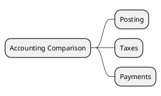

# Accounting v18 vs v19

> **Summary:** Placeholder to consolidate GL, invoicing, and bank feature changes. Aligns with `[[Odoo 18/Core/Processes/Accounting/account_move.md]]` and the invoice-to-cash flow `[[Odoo 18/Community Addons/Finance/invoice_to_cash.md]]`.

## Focus areas
- Journal entry posting (`account.move`): check new fields or workflow changes in v19.
- Taxes and fiscal positions: compare configuration defaults and report structures.
- Payments and reconciliation: identify UI or API changes in `account.payment` and bank statement widgets.

## Preliminary findings
- Preferred payment routing now cascades via `preferred_payment_method_line_id` (mirroring Sales) and picks partner bank accounts using currency-aware sorting.
- Receipt flows can enforce dedicated fiscal positions through company-level defaults, and `_get_accounting_date_source` centralises accounting-date selection.

- v19 moves `account.move` onto the new `account.document.import.mixin`, enabling document ingestion alignment with Sales.
- New adjusting-entry helpers (`adjusting_entry_origin_move_ids`, counters) support automated closing adjustments.
- Journal line subsets via `journal_line_ids` expose non-section lines separately.
- The `checked`/`no_followup` fields now compute/inverse, refining follow-up exclusions.
- Domain helper import (`Domain`) and removal of deprecated index helpers reflect the ORM refactor.
- Follow-up controls expand with `no_followup` and computed `checked` flags, plus new adjusting-entry count fields for closing automation.

## Data points to capture
- Fields added/removed between versions.
- Behaviour toggles or new settings in `res.config.settings`.
- Report template differences (PDF/QWeb).

## Migration checklist
- Swap manual journal search logic to `_get_suitable_journal_ids` where applicable.
- Consider the split between `line_ids` and `journal_line_ids` when inheriting tree views or validating data.
- Adapt custom payment-bank logic to respect `preferred_payment_method_line_id` and the new bank sorting rules.

## Next steps
- Extract diffs from `addons/account` `models/account_move.py` and `models/account_payment.py`.
- Update migration checklist once v19 repository is reviewed.

