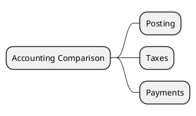

# Accounting v18 vs v19

> **Summary:** Placeholder to consolidate GL, invoicing, and bank feature changes. Aligns with `[[Odoo 18/Core/Processes/Accounting/account_move.md]]` and the invoice-to-cash flow `[[Odoo 18/Community Addons/Finance/invoice_to_cash.md]]`.

## Focus areas
- Journal entry posting (`account.move`): check new fields or workflow changes in v19.
- Taxes and fiscal positions: compare configuration defaults and report structures.
- Payments and reconciliation: identify UI or API changes in `account.payment` and bank statement widgets.

## Preliminary findings
- v19 moves `account.move` onto the new `account.document.import.mixin`, enabling document ingestion alignment with Sales.
- New adjusting-entry helpers (`adjusting_entry_origin_move_ids`, counters) support automated closing adjustments.
- Journal line subsets via `journal_line_ids` expose non-section lines separately.
- The `checked`/`no_followup` fields now compute/inverse, refining follow-up exclusions.
- Domain helper import (`Domain`) and removal of deprecated index helpers reflect the ORM refactor.

## Data points to capture
- Fields added/removed between versions.
- Behaviour toggles or new settings in `res.config.settings`.
- Report template differences (PDF/QWeb).

## Next steps
- Extract diffs from `addons/account` `models/account_move.py` and `models/account_payment.py`.
- Update migration checklist once v19 repository is reviewed.

