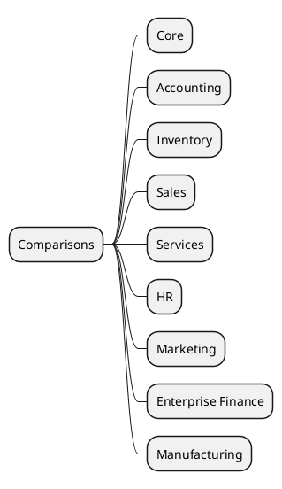

# Comparisons v18 vs v19

## Difference maps
- [[Comparisons/Core ORM]]
- [[Comparisons/Accounting v18-v19]]
- [[Comparisons/Inventory v18-v19]]
- [[Comparisons/Sales v18-v19]]
- [[Comparisons/Services v18-v19]]
- [[Comparisons/HR v18-v19]]
- [[Comparisons/Marketing v18-v19]]
- [[Comparisons/Enterprise Finance v18-v19]]
- [[Comparisons/Manufacturing v18-v19]]

## Suggestions
- Baseline docs: [[Odoo 18/Core/Master Data/res_partner.md]], [[Odoo 18/Core/Master Data/product_template.md]], [[Odoo 18/Core/Processes/Accounting/account_move.md]], [[Odoo 18/Community Addons/Sales/lead_to_cash.md]], [[Odoo 18/Community Addons/Finance/invoice_to_cash.md]]
- Use the [[Templates/Cross-Version Diff Template]] template.
- Add tables describing field and flow changes.
- Document recommended migration scripts.
- Cross-link to core/process notes where deltas were observed.

## Navigation
- **Parent:** [[Welcome]]

## Children
- [[Comparisons/Accounting v18-v19]]
- [[Comparisons/Core ORM]]
- [[Comparisons/Enterprise Finance v18-v19]]
- [[Comparisons/HR v18-v19]]
- [[Comparisons/Inventory v18-v19]]
- [[Comparisons/Manufacturing v18-v19]]
- [[Comparisons/Marketing v18-v19]]
- [[Comparisons/Sales v18-v19]]
- [[Comparisons/Services v18-v19]]