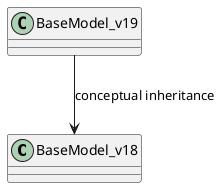

# Core ORM v18 vs v19

## Detected changes (high-level)

| Area | v18 | v19 | Notes |
|------|-----|-----|-------|
| ORM public API | Stable decorators (`@api.model`, `@api.depends`, etc.). | Same API; investigate additions (e.g., autovacuum helpers). | Detailed diff pending. |
| Prefetch/flush | Prefetch behaviour as in previous versions; batched invalidation. | Need verification for new cache invalidations. | Placeholder for analysis. |
| View integration | QWeb forms interact via RPC. | OWL refactor doesn’t alter ORM but ensure context compatibility. | |

## Impact
- No breaking changes identified yet; extensions targeting `models.Model` should remain compatible.
- Monitor new helpers/decorators when planning migrations.

## Diagram

## Tasks
- Analyze ORM commits.
- Document new decorators.
- Record breaking changes.
