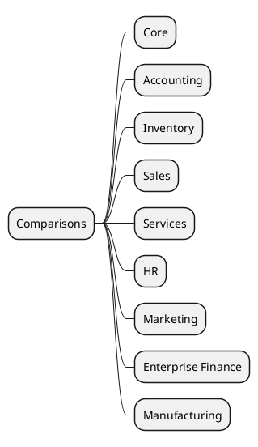

# Comparisons v18 vs v19

## Difference maps
- [[Comparisons/Core ORM]]
- [[Comparisons/Accounting v18-v19]]
- [[Comparisons/Inventory v18-v19]]
- [[Comparisons/Sales v18-v19]]
- [[Comparisons/Services v18-v19]]
- [[Comparisons/HR v18-v19]]
- [[Comparisons/Marketing v18-v19]]
- [[Comparisons/Enterprise Finance v18-v19]]
- [[Comparisons/Manufacturing v18-v19]]

## Suggestions
- Use the [[Templates/Cross-Version Diff Template]] template.
- Add tables describing field and flow changes.
- Document recommended migration scripts.
- Cross-link to core/process notes where deltas were observed.
