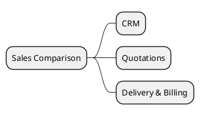

# Sales v18 vs v19

> **Summary:** Tracks functional and technical differences across CRM and Sales Order flows between v18 and v19. Use together with `[[Odoo 18/Community Addons/Sales/lead_to_cash.md]]` and core process documentation.

## Topics to analyse
- CRM pipeline: new stages, scoring, or activity automation in v19.
- Quotation editor: UX changes, inline product configurator updates.
- Pricing/pricelist calculations: additional discount rules or currency handling.
- Delivery & invoicing policies: confirm whether the step configuration changed.

## Data sources
- v18 reference: `[[Odoo 18/Community Addons/Sales/sale_management.md]]`
- v19 reference placeholder: `[[Odoo 19/Community Addons/Sales/sale_management.md]]`
- Supporting modules: `crm`, `sale_project`, `sale_subscription`.

## Key observations so far
- v19 adds the `account.document.import.mixin` to `sale.order`, exposing accounting document import entry points.
- New payment experience introduces `preferred_payment_method_line_id` and asynchronous pending-email templates for checkout flows.
- Security tweaks use `all_group_ids` domains and add groups on transactions/tags, aligning with new security refinements (see `[[Odoo 18/Core/Infrastructure/Security.md]]`).
- ORM API usage updated: constraints and indexes declared via `models.Constraint` / `models.Index`, context access through `env.context`.
- Additional helpers: imports `Domain`, `OrderedSet`, and `str2bool` to support richer search/payment features.

## Next steps
- Pull diff of `addons/sale/models/sale_order.py` and CRM models.
- Validate portal acceptance/signature workflow changes.
- Update this note once v19 behaviour is verified.

