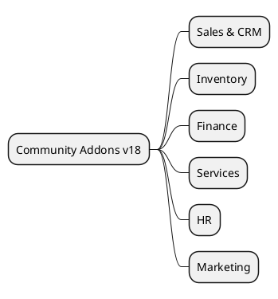

# Odoo 18 Community Addons

## Functional clusters
- Sales and CRM -> `[[Odoo 18/Community Addons/Sales]]`
- Inventory and Logistics -> `[[Odoo 18/Community Addons/Inventory]]`
- Basic Finance -> `[[Odoo 18/Community Addons/Finance]]`
- Projects and Services -> `[[Odoo 18/Community Addons/Services]]`
- Human Resources -> `[[Odoo 18/Community Addons/HR]]`
- Website and Marketing -> `[[Odoo 18/Community Addons/Marketing]]`

## Priority actions
- Consolidates list of official CE modules by mapping `addons/__manifest__.py`.
- Highlights cross dependencies and Core extension points.
- Point out modules that change radically between v18 and v19 to compare them.

## References
- `[[Odoo 18]]`
- `[[Odoo 18/Core]]`
- `[[Comparisons]]`

## Navigation
- Sales lead-to-cash flow -> `[[Odoo 18/Community Addons/Sales/lead_to_cash.md]]`
- Finance invoice-to-cash flow -> `[[Odoo 18/Community Addons/Finance/invoice_to_cash.md]]`

## Navigation
- **Parent**: [[Odoo 18]]`n- **Children**:
  - [[Odoo 18/Community Addons/Sales]]`n  - [[Odoo 18/Community Addons/Inventory]]`n  - [[Odoo 18/Community Addons/Finance]]`n  - [[Odoo 18/Community Addons/Services]]`n  - [[Odoo 18/Community Addons/HR]]`n  - [[Odoo 18/Community Addons/Marketing]]`n

## Children
- [[Odoo 18/Community Addons/Finance]]
- [[Odoo 18/Community Addons/HR]]
- [[Odoo 18/Community Addons/Inventory]]
- [[Odoo 18/Community Addons/Marketing]]
- [[Odoo 18/Community Addons/Sales]]
- [[Odoo 18/Community Addons/Services]]