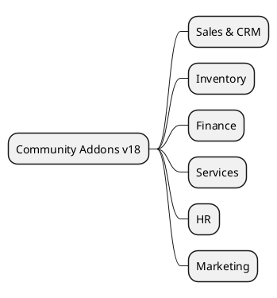

# Odoo 18 Community Addons

## Functional clusters
- Sales and CRM -> `[[Odoo 18/Community Addons/Sales]]`
- Inventory and Logistics -> `[[Odoo 18/Community Addons/Inventory]]`
- Basic Finance -> `[[Odoo 18/Community Addons/Finance]]`
- Projects and Services -> `[[Odoo 18/Community Addons/Services]]`
- Human Resources -> `[[Odoo 18/Community Addons/HR]]`
- Website and Marketing -> `[[Odoo 18/Community Addons/Marketing]]`

```plantuml
@startmindmap
* Community Addons v18
** Sales & CRM
** Inventory
** Finance
** Services
** HR
** Marketing
@endmindmap
```

## Priority actions
- Consolidates list of official CE modules by mapping `addons/__manifest__.py`.
- Highlights cross dependencies and Core extension points.
- Point out modules that change radically between v18 and v19 to compare them.

## References
- `[[Odoo 18]]`
- `[[Odoo 18/Core]]`
- `[[Comparisons]]`

## Navigation
- **Parent:** [[Odoo 18/Odoo 18]]
## Navigation
- **Parent:** [[Odoo 18/Odoo 18]]
## Children
- [[Odoo 18/Community Addons/Finance/Finance]]
- [[Odoo 18/Community Addons/HR/HR]]
- [[Odoo 18/Community Addons/Inventory/Inventory]]
- [[Odoo 18/Community Addons/Marketing/Marketing]]
- [[Odoo 18/Community Addons/Sales/Sales]]
- [[Odoo 18/Community Addons/Services/Services]]
<!-- GENERATED:CATEGORIES -->
## Categories

- [[Odoo 18/Community Addons/Communication/Communication|Communication]] (7)
- [[Odoo 18/Community Addons/Finance/Finance|Finance]] (19)
- [[Odoo 18/Community Addons/HR/HR|HR]] (33)
- [[Odoo 18/Community Addons/Inventory/Inventory|Inventory]] (32)
- [[Odoo 18/Community Addons/IoT/IoT|IoT]] (3)
- [[Odoo 18/Community Addons/Localizations/Localizations|Localizations]] (207)
- [[Odoo 18/Community Addons/Marketing/Marketing|Marketing]] (16)
- [[Odoo 18/Community Addons/Misc/Misc|Misc]] (93)
- [[Odoo 18/Community Addons/Payments/Payments|Payments]] (17)
- [[Odoo 18/Community Addons/Point of Sale/Point of Sale|Point of Sale]] (33)
- [[Odoo 18/Community Addons/Sales/Sales|Sales]] (46)
- [[Odoo 18/Community Addons/Services/Services|Services]] (25)
- [[Odoo 18/Community Addons/Technical/Technical|Technical]] (7)
- [[Odoo 18/Community Addons/Website/Website|Website]] (58)

<!-- GENERATED:CATEGORIES -->
