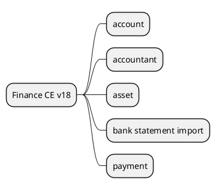

# BasicFinance v18

## Modules
- `[[Odoo 18/Community Addons/Finance/invoice_to_cash.md]]` (flow overview)

- `[[Odoo 18/Community Addons/Finance/account.md]]`
- `[[Odoo 18/Community Addons/Finance/account_accountant.md]]`
- `[[Odoo 18/Community Addons/Finance/account_asset.md]]`
- `[[Odoo 18/Community Addons/Finance/account_bank_statement_import.md]]`
- `[[Odoo 18/Community Addons/Finance/account_payment.md]]`

## All
- Document billing -> reconciliation process.
- Map integration with taxes and locations.
- Identify differences with Enterprise.

## Navigation
- **Parent:** [[Odoo 18/Community Addons/Index]]

## Children
- [[Odoo 18/Community Addons/Finance/account]]
- [[Odoo 18/Community Addons/Finance/account_accountant]]
- [[Odoo 18/Community Addons/Finance/account_asset]]
- [[Odoo 18/Community Addons/Finance/account_bank_statement_import]]
- [[Odoo 18/Community Addons/Finance/account_payment]]
- [[Odoo 18/Community Addons/Finance/invoice_to_cash]]