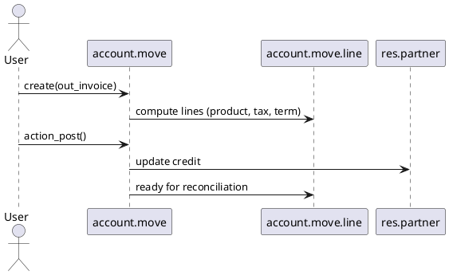

# Accounting Base Module (`account`)

> **Summary:** The `account` module supplies the core bookkeeping capabilities: chart of accounts, journals, invoices/bills, reconciliation tooling, and basic reports. It underpins every other financial feature in Community edition and is the backbone for Enterprise finance apps.

## 1. Principal models

| Model | File | Responsibilities |
|-------|------|------------------|
| `account.move` / `account.move.line` | `addons/account/models/account_move.py` | Accounting documents and ledger lines (invoices, bills, journal entries). Handle posting, tax computation, locking. |
| `account.journal` | `addons/account/models/account_journal.py` | Journals with sequences, default accounts, posting control. |
| `account.account` | `addons/account/models/account_account.py` | Chart of accounts. Store type, tags, company, tax settings. |
| `account.tax`, `account.tax.repartition.line` | `addons/account/models/account_tax.py` | Tax computation and repartition (base/tax accounts). |
| `account.payment` (in base) | `addons/account/models/account_payment.py` | Payment documents (mostly extended by `account_payment` module). |
| Reconciliation models | `addons/account/models/account_reconcile_model.py` | Auto reconciliation templates.

**Note:** See `[[Odoo 18/Core/Processes/Accounting/Index]]` for process-level overview.

## 2. Chart of accounts & configuration
- Loaded via chart templates (`account.chart.template`) per localisation. Install wizard asks for template and fiscal settings.
- Accounts grouped by `account.group`. Types determine financial statements & cash basis use.
- Company defaults stored through `ir.property` (receivable/payable accounts). Documented in `[[Odoo 18/Core/Master Data/res_company.md]]` (todo: dedicated property note).

## 3. Journals
- Types: `sale`, `purchase`, `bank`, `cash`, `general`. Each has sequence (`ir.sequence`) controlling numbering.
- `post_at`: immediate vs batch posting; locking respects `company_id`. Sequence per journal ensures unique references.
- Bank/cash journals tie to payment methods and bank reconciliation.

## 4. Invoicing flow
- Customer invoices: created in `account.move` with `move_type='out_invoice'`. Confirmed via `action_post`.
- Vendor bills: `move_type='in_invoice'` similar flow.
- Refunds/credit notes: `move_type='out_refund'` etc.; generated via `action_reverse` wizard.
- Taxes computed on move lines; support tax-inclusive pricing via `tax_price_include`.
- Payment terms: `account.payment.term` split invoice into multiple move lines; due dates on journal entries.

### Sequence diagram

## 5. Reconciliation
- Manual: reconciliation widget (list view) matches lines via `account.move.line.reconcile()`.
- Automatic: `account.reconcile.model` rules (amount tolerance, partner matching, regex) used from widget or bank statement reconciliation.
- Partial reconciliation tracked via `account.partial.reconcile`; full reconciliation closes counterpart lines.

## 6. Reporting
- Built-in CE reports: customer invoice analysis, aged partner balance, general ledger. SQL views (`account.invoice.report`, `account.move.line`) feed pivot/graph.
- Tax closing: `account_tax_periodicity` (Enterprise) adds advanced features; base module still computes tax report lines via `account.tax.report`.

## 7. Integrations
- **Sales/Purchases**: `sale`, `purchase` modules call `_create_invoices` / `_create_bills`. Deliveries update invoiceable quantities (see respective notes).
- **Inventory**: `stock_account` posts valuation entries using accounts defined on product categories.
- **Payments**: `account_payment` extends base payment model with inbound/outbound payment UI.
- **Bank statements**: `account_bank_statement_import` + `account_bank_statement` feed reconciliation.

## 8. Configuration pointers
- Accounting settings (`res.config.settings`): fiscal period locking, default taxes, cash rounding, multi-currencies.
- For multi-company, uses fields on `res.company` (lock dates, currency). Integration described in `[[Odoo 18/Core/Master Data/res_company.md]]`.

## 9. To-do (Issue #19)
- [ ] Add examples of localisation-specific differences (e.g., default accounts) when localisation notes are ready.
- [ ] Document bank reconciliation widget once relevant notes exist.
- [ ] Provide snippet of JSON RPC for invoice creation and posting.

## Navigation
- Flow overview: [[Odoo 18/Community Addons/Finance/invoice_to_cash.md]]
- **Parent:** `[[Odoo 18/Community Addons/Finance/Index]]`
- **Related:** `[[Odoo 18/Core/Processes/Accounting/Index]]`, `[[Odoo 18/Core/Master Data/res_company.md]]`, `[[Odoo 18/Core/Processes/Sales/Index]]`
- **Issue:** #19 `Docs: Odoo 18 - Community Finance suite`
