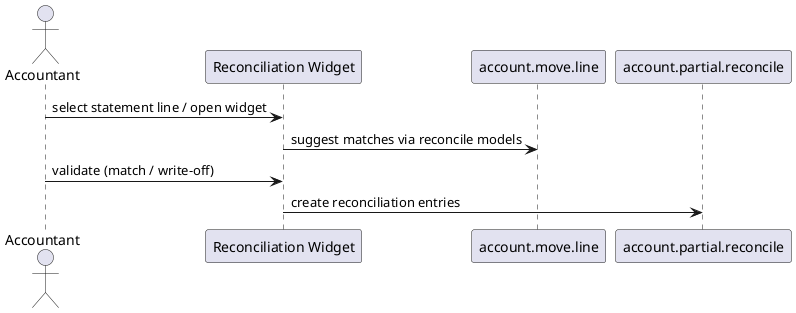

# Account Accountant Module (Odoo 18)

> **Summary:** Adds advanced accounting tools on top of the base `account` module: manual journal entry UI, advanced reconciliation, period closing helpers, and extended reports. In Community these features remain available without the Enterprise reports pack.

## 1. Key features

| Feature | Description |
|---------|-------------|
| Advanced reconciliation widget | Handles batch reconciliation with suggestions, write-offs, propagation of analytics. |
| Manual journal entries | Enhanced UI for creating `account.move` entries (general journal) with templates. |
| Tax closing helpers | Configure tax closing entries; interact with `res.company` lock dates. |
| Reports | Provides additional pivot/graph views and filters (e.g., general ledger, partner ledger). |

## 2. Reconciliation workflow

- Enhances capabilities of `account.bank.statement` matching and manual reconciliation from accounting dashboard.
- Offers suggestion filters (matching references, amounts, partners).
- Write-offs configured via `account.reconcile.model` for default accounts and analytic tags.

## 3. Closing & reports
- Adds wizard for finalizing tax periods (`account.period.close`), updating lock dates and generating entries when closing fiscal year.
- Provided reports include: General Ledger, Partner Ledger, Trial Balance (graph/pivot views and printable versions).
- Integration with `account_reports` (Enterprise) enhances output but core module still provides pivot reports.

## 4. Configuration
- Accounting dashboard accesses reconciliation and reporting views.
- Settings (`res.config.settings`): options for cash rounding, tax lock dates, invoice cash basis.
- Security groups: `account.group_account_manager`, `account.group_account_user` determine access to features.

## 5. To-do (Issue #19)
- [ ] Document actual wizard names/screenshots when UI references ready.
- [ ] Link to tax closing workflow once note is prepared.
- [ ] Describe manual entry templates (recurring entries) in detail.

## Navigation
- **Parent:** `[[Odoo 18/Community Addons/Finance]]`
- **Related:** `[[Odoo 18/Community Addons/Finance/account.md]]`, `[[Odoo 18/Core/Processes/Accounting]]`
- **Issue:** #19 `Docs: Odoo 18 - Community Finance suite`
