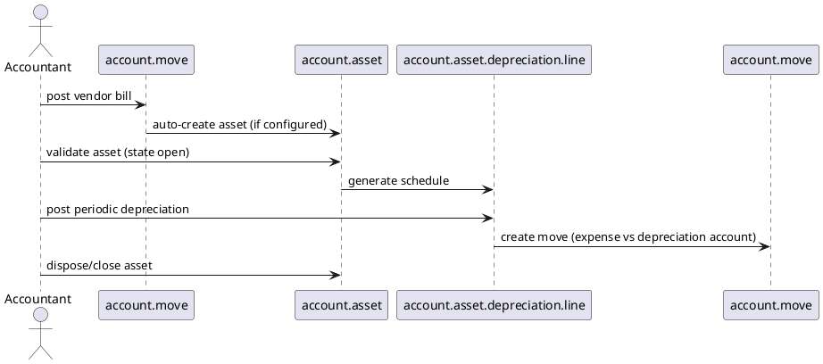

# Account Asset Module (Odoo 18)

> **Summary:** Provides fixed asset management: asset creation from purchases, depreciation schedules, and journal entries. It relies on `account` for posting and integrates with purchase/invoice flows.

## 1. Principal models

| Model | File | Responsibilities |
|-------|------|------------------|
| `account.asset` | `addons/account_asset/models/account_asset.py` | Represents an asset with depreciation method, accounting entries, status (draft, open, closed). |
| `account.asset.category` | `account_asset/models/account_asset.py` | Defines default accounts, journal, depreciation method, frequency. |
| `account.asset.depreciation.line` | `account_asset/models/account_asset.py` | Individual depreciation entries (schedule). |
| `account.asset.transfer` / `account.asset.depreciation.confirmation.wizard` | Wizards for disposal, mass posting. |

## 2. Asset lifecycle

1. **Creation:** manual or from vendor bill lines (product flagged `asset_category_id`).
2. **Validation:** asset moves to `open` state; depreciation lines generated according to method (linear, degressive, accelerated).
3. **Posting:** cron or manual action posts depreciation entries to `account.move` using configured accounts.
4. **Disposal:** asset sold or scrapped; closing entry via disposal wizard; possible reversal of remaining depreciation.

## 3. Configuration
- Asset categories define default accounts:
  - Asset account, Depreciation account, Expense account.
  - Journal for accounting entries.
  - Depreciation method (linear, degressive), period length, number of entries.
- Company-specific settings (first depreciation date, rounding) per category.
- Assets created from invoices: product template has `asset_category_id` or category defined on account.

## 4. Integration
- **Accounting:** every posted depreciation creates `account.move` lines (expense + accumulated depreciation). Works with `[[Odoo 18/Core/Processes/Accounting]]`.
- **Purchasing:** vendor bills automatically create assets; purchase order lines can pass category.
- **Reporting:** asset analysis via `account.asset.report` (Pivot/Graph); integration with financial statements (balance sheet).
- **Disposal:** integration with sales (selling asset) creates revenue move lines.

## 5. To-do (Issue #19)
- [ ] Document how partial asset posting works with multi-currency.
- [ ] Add example of asset creation from bill (bill line screenshot / JSON).
- [ ] Include disposal flow once note on accounting adjustments exists.

## Navigation
- **Parent:** [[Odoo 18/Community Addons/Finance/Finance]]
