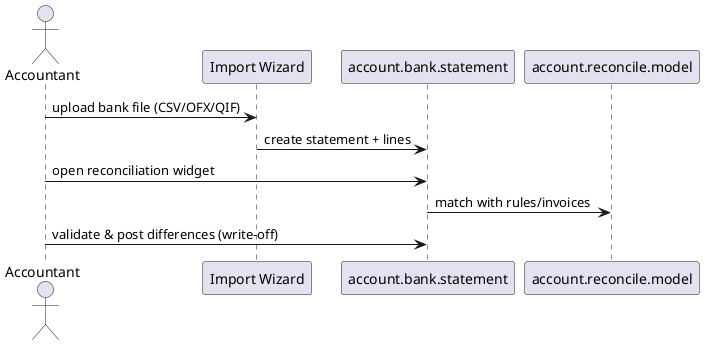

# Bank Statement Import Module (Odoo 18)

> **Summary:** Simplifies importing bank statement files (CSV, OFX, QIF) and feeding the reconciliation widget. It complements manual `account.payment` entries by auto-populating statements.

## 1. Principal models

| Model | File | Responsibilities |
|-------|------|------------------|
| `account.bank.statement` / `account.bank.statement.line` | `addons/account/models/account_bank_statement.py` | Represent imported statements and lines. Stores journal/partner/amount for reconciliation. |
| `account.reconcile.model` | `account/models/account_reconcile_model.py` | Used to auto-match imported lines with accounting entries. |
| Importers (`account_bank_statement_import/models/*.py`) | Format-specific parsers (OFX, QIF, CSV). | Parse file and create statement records. |

## 2. Import flow

- Wizards: `account.bank.statement.import` handles uploads. Each parser extends `account_bank_statement_import/parser/*`.
- Statements assigned to bank journals; `balance_start`, `balance_end_real` enable bank reconciliation.
- Lines include `date`, `amount`, `name`, `ref`, `partner_id`. Matching relies on existing invoices/payments or reconciliation models.

## 3. Reconciliation integration
- Reconciliation widget (`account.reconciliation.widget`) consumes statement lines. See `[[Odoo 18/Community Addons/Finance/account.md]]` for reconciliation logic.
- Automatic matches via `account.reconcile.model` (amount, partner, regex). Manual adjustments create write-offs using configured accounts.
- Process updates invoice residual amounts, creates payments if needed.

## 4. Configuration
- Bank journals must allow statement imports (`bank_statements_source = file_import`).
- `res.config.settings` toggles available file formats and features.
- Implementation requires mapping CSV columns; templates stored in `account.bank.statement.import.template`.

## 5. To-do (Issue #19)
- [ ] Document specific CSV template configuration.
- [ ] Add screenshots/examples of reconciliation widget.
- [ ] Reference bank synchronization (Enterprise) when documented.

## Navigation
- **Parent:** [[Odoo 18/Community Addons/Finance/Finance]]
