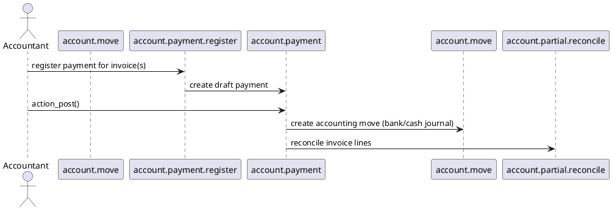

# Account Payment Module (Odoo 18)

> **Summary:** Extends the base accounting module with dedicated payment entries (inbound/outbound) and a user interface for payment registration, journals, and reconciliation. It is the foundation for SEPA, check printing, and other payment provider modules.

## 1. Principal models

| Model | File | Responsibilities |
|-------|------|------------------|
| `account.payment` | `addons/account/models/account_payment.py` (extended by this module) | Represents payments (customer receipts, vendor payments, internal transfers). Handles posting, cancellation, and move creation. |
| `account.payment.register` (wizard) | `addons/account/wizards/account_payment_register.py` | Registers payments from invoices/bills, producing `account.payment` records. |
| `account.payment.method` / `account.payment.method.line` | `addons/account/models/account_payment.py` | Define available payment methods per journal (manual, SEPA, checks). |
| `account.payment.return` (module dependent) | Manage payment returns/refunds. |

## 2. Workflow

### Key steps
- Wizard picks invoices (`account.move`) and prepares payment values (partner, amount, method, journal).
- `account.payment.create()` generates payment record; `action_post()` creates move lines in bank/cash journal.
- Reconciliation: payments reconcile with invoices via `action_post()` (auto) or manually, depending on method.
- Cancellation: `action_cancel()` unreconciles and resets to draft; `unlink` prevented once posted unless unposted first.

## 3. Payment methods & journals
- Payment methods configured per journal (`account.journal`). Standard methods: manual, checks, SEPA, bank transfer.
- Each method has matching inbound/outbound type (`inbound`, `outbound`, `transfer`).
- Payment differences: small write-offs via `payment_difference_handling` (open vs reconcile difference account).

## 4. Integration
- **Bank reconciliation:** payments appear in reconciliation widget for matching with bank statement lines.
- **Payment providers:** modules like `payment_sepa`, `l10n_*` extend `account.payment` to generate SEPA files or checks.
- **Invoicing:** `account.move` uses wizard to register payments; residual amount updates automatically.
- **Multi-currency:** currency fields handle conversions using `currency_id`, `amount_currency`.

## 5. Configuration
- Journal settings: default debit/credit accounts, payment methods, suspense accounts for transfers.
- Payment terms vs immediate payment: wizard respects remaining balances per invoice.
- Access rights: `account.group_account_invoice`, `account.group_account_manager` govern creation/posting.

## 6. To-do (Issue #19)
- [ ] Document SEPA/check workflows in dedicated notes when available.
- [ ] Provide example of registering partial payment and write-off.
- [ ] Link to bank statement reconciliation once note exists.

## Navigation
- **Parent:** `[[Odoo 18/Community Addons/Finance]]`
- **Related:** `[[Odoo 18/Core/Processes/Accounting]]`, `[[Odoo 18/Community Addons/Finance/account_bank_statement_import.md]]`, `[[Odoo 18/Community Addons/Finance/account.md]]`
- **Issue:** #19 `Docs: Odoo 18 - Community Finance suite`
