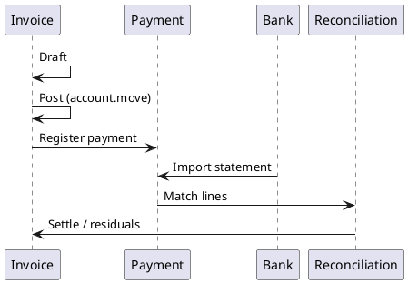

# Invoice-to-Cash Flow (Finance CE)

> **Summary:** Tracks the financial workflow from invoice creation through payment reconciliation in Odoo 18 Community Edition. It ties together sales/purchase origins, journal entries, bank statements, and customer communications.

## Stages
1. **Invoice creation**: moves spawned from Sales Orders, Purchase Bills, subscriptions, or manual entries. Draft `account.move` references partner, journal, and taxes.
2. **Validation**: `action_post` generates immutable journal entries (see `[[Odoo 18/Core/Processes/Accounting/account_move.md]]`).
3. **Distribution**: invoices sent via email/portal using templates and attachments stored per `[[Odoo 18/Core/Infrastructure/Files.md]]`.
4. **Payment capture**:
   - Manual payments: `account.payment.register` wizard creates payment moves.
   - ePayment / SEPA: optional modules extend with automatic reconciliation.
   - Bank statements: `account.bank.statement` import matches open receivables.
5. **Reconciliation**: widget matches payment lines to invoice lines, updating `payment_state` and generating partial/full reconcile records.
6. **Follow-up**: dunning via `account.followup.report` and activities assigned to responsible users.

## Modules involved
- `account` (core engine)
- `account_payment` (payment registration wizard)
- `account_bank_statement_import` (bank feeds)
- `mail` / `portal` for communications

## Data dependencies
- Partners: `[[Odoo 18/Core/Master Data/res_partner.md]]`
- Journals & accounts: `[[Odoo 18/Community Addons/Finance/account.md]]`, `[[Odoo 18/Core/Processes/Accounting/account_move.md]]`
- Payments: `[[Odoo 18/Community Addons/Finance/account_payment.md]]`

## Infrastructure hooks
- Reports: customer statements, invoice PDFs use `[[Odoo 18/Core/Infrastructure/Reports.md]]`.
- Security: closing periods and journal access rely on `[[Odoo 18/Core/Infrastructure/Security.md]]`.
- Real-time alerts: follow-ups trigger bus notifications (`[[Odoo 18/Core/Infrastructure/Bus.md]]`).

## Related documentation
- `[[Odoo 18/Core/Processes/Accounting/Index.md]]`
- `[[Odoo 18/Community Addons/Finance/account.md]]`
- `[[Odoo 18/Community Addons/Sales/lead_to_cash.md]]`
- `[[Odoo 18/Community Addons/Finance/account_payment.md]]`
