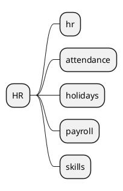

# Human Resources v18

## Modules
- `[[Odoo 18/Community Addons/HR/hr.md]]`
- `[[Odoo 18/Community Addons/HR/hr_attendance.md]]`
- `[[Odoo 18/Community Addons/HR/hr_holidays.md]]`
- `[[Odoo 18/Community Addons/HR/hr_payroll.md]]`
- `[[Odoo 18/Community Addons/HR/hr_skills.md]]`

## Goals
- Map the employee life cycle.
- Document integration with accounting and projects.
-Analyze regional configurations.

## Navigation
- **Parent:** [[Odoo 18/Community Addons/Index]]

## Children
- [[Odoo 18/Community Addons/HR/hr]]
- [[Odoo 18/Community Addons/HR/hr_attendance]]
- [[Odoo 18/Community Addons/HR/hr_holidays]]
- [[Odoo 18/Community Addons/HR/hr_payroll]]
- [[Odoo 18/Community Addons/HR/hr_skills]]