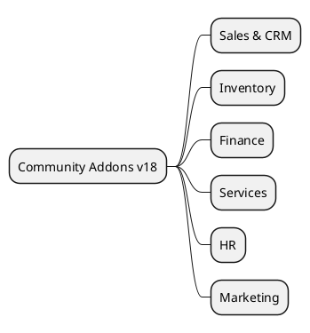

# Odoo 18 Community Addons

## Functional clusters
- Sales and CRM -> `[[Odoo 18/Community Addons/Sales/Index]]`
- Inventory and Logistics -> `[[Odoo 18/Community Addons/Inventory/Index]]`
- Basic Finance -> `[[Odoo 18/Community Addons/Finance/Index]]`
- Projects and Services -> `[[Odoo 18/Community Addons/Services/Index]]`
- Human Resources -> `[[Odoo 18/Community Addons/HR/Index]]`
- Website and Marketing -> `[[Odoo 18/Community Addons/Marketing/Index]]`

## Priority actions
- Consolidates list of official CE modules by mapping `addons/__manifest__.py`.
- Highlights cross dependencies and Core extension points.
- Point out modules that change radically between v18 and v19 to compare them.

## References
- `[[Odoo 18/Index]]`
- `[[Odoo 18/Core/Index]]`
- `[[Comparisons/Index]]`

## Navigation
- Sales lead-to-cash flow -> `[[Odoo 18/Community Addons/Sales/lead_to_cash.md]]`
- Finance invoice-to-cash flow -> `[[Odoo 18/Community Addons/Finance/invoice_to_cash.md]]`

## Navigation
- **Parent**: [[Odoo 18/Index]]`n- **Children**:
  - [[Odoo 18/Community Addons/Sales/Index]]`n  - [[Odoo 18/Community Addons/Inventory/Index]]`n  - [[Odoo 18/Community Addons/Finance/Index]]`n  - [[Odoo 18/Community Addons/Services/Index]]`n  - [[Odoo 18/Community Addons/HR/Index]]`n  - [[Odoo 18/Community Addons/Marketing/Index]]`n
