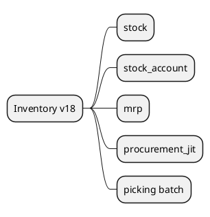

# Inventory v18

## Modules
- `[[Odoo 18/Community Addons/Inventory/stock.md]]`
- `[[Odoo 18/Community Addons/Inventory/stock_account.md]]`
- `[[Odoo 18/Community Addons/Inventory/mrp.md]]`
- `[[Odoo 18/Community Addons/Inventory/procurement_jit.md]]`
- `[[Odoo 18/Community Addons/Inventory/stock_picking_batch.md]]`

## Actions
- Map movement and reservation statuses.
- Document integration with accounting.
-Analyze basic MRP capabilities.

## Navigation
- **Parent:** [[Odoo 18/Community Addons/Community Addons]]
## Children
- [[Odoo 18/Community Addons/Inventory/mrp]]
- [[Odoo 18/Community Addons/Inventory/procurement_jit]]
- [[Odoo 18/Community Addons/Inventory/stock]]
- [[Odoo 18/Community Addons/Inventory/stock_account]]
- [[Odoo 18/Community Addons/Inventory/stock_picking_batch]]
