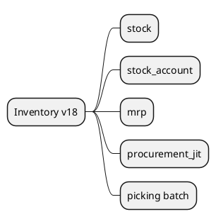

# Inventory v18

## Modules
- `[[Odoo 18/Community Addons/Inventory/stock.md]]`
- `[[Odoo 18/Community Addons/Inventory/stock_account.md]]`
- `[[Odoo 18/Community Addons/Inventory/mrp.md]]`
- `[[Odoo 18/Community Addons/Inventory/procurement_jit.md]]`
- `[[Odoo 18/Community Addons/Inventory/stock_picking_batch.md]]`

```plantuml
@startmindmap
* Inventory v18
** stock
** stock_account
** mrp
** procurement_jit
** picking batch
@endmindmap
```

## Actions
- Map movement and reservation statuses.
- Document integration with accounting.
-Analyze basic MRP capabilities.

## Navigation
- **Parent:** [[Odoo 18/Community Addons/Community Addons]]
## Children
- [[Odoo 18/Community Addons/Inventory/mrp]]
- [[Odoo 18/Community Addons/Inventory/procurement_jit]]
- [[Odoo 18/Community Addons/Inventory/stock]]
- [[Odoo 18/Community Addons/Inventory/stock_account]]
- [[Odoo 18/Community Addons/Inventory/stock_picking_batch]]
<!-- GENERATED:CATEGORY -->
---
tags: [odoo, v18, community, index, category]
---

# Inventory

Modules: 32

- [[Odoo 18/Community Addons/delivery_mondialrelay/delivery_mondialrelay|delivery_mondialrelay]]
- [[Odoo 18/Community Addons/maintenance/maintenance|maintenance]]
- [[Odoo 18/Community Addons/mrp/mrp|mrp]]
- [[Odoo 18/Community Addons/mrp_account/mrp_account|mrp_account]]
- [[Odoo 18/Community Addons/mrp_landed_costs/mrp_landed_costs|mrp_landed_costs]]
- [[Odoo 18/Community Addons/mrp_product_expiry/mrp_product_expiry|mrp_product_expiry]]
- [[Odoo 18/Community Addons/mrp_repair/mrp_repair|mrp_repair]]
- [[Odoo 18/Community Addons/mrp_subcontracting/mrp_subcontracting|mrp_subcontracting]]
- [[Odoo 18/Community Addons/mrp_subcontracting_account/mrp_subcontracting_account|mrp_subcontracting_account]]
- [[Odoo 18/Community Addons/mrp_subcontracting_dropshipping/mrp_subcontracting_dropshipping|mrp_subcontracting_dropshipping]]
- [[Odoo 18/Community Addons/mrp_subcontracting_landed_costs/mrp_subcontracting_landed_costs|mrp_subcontracting_landed_costs]]
- [[Odoo 18/Community Addons/mrp_subcontracting_purchase/mrp_subcontracting_purchase|mrp_subcontracting_purchase]]
- [[Odoo 18/Community Addons/mrp_subcontracting_repair/mrp_subcontracting_repair|mrp_subcontracting_repair]]
- [[Odoo 18/Community Addons/product_expiry/product_expiry|product_expiry]]
- [[Odoo 18/Community Addons/purchase/purchase|purchase]]
- [[Odoo 18/Community Addons/purchase_edi_ubl_bis3/purchase_edi_ubl_bis3|purchase_edi_ubl_bis3]]
- [[Odoo 18/Community Addons/purchase_mrp/purchase_mrp|purchase_mrp]]
- [[Odoo 18/Community Addons/purchase_product_matrix/purchase_product_matrix|purchase_product_matrix]]
- [[Odoo 18/Community Addons/purchase_repair/purchase_repair|purchase_repair]]
- [[Odoo 18/Community Addons/purchase_requisition/purchase_requisition|purchase_requisition]]
- [[Odoo 18/Community Addons/purchase_requisition_sale/purchase_requisition_sale|purchase_requisition_sale]]
- [[Odoo 18/Community Addons/purchase_requisition_stock/purchase_requisition_stock|purchase_requisition_stock]]
- [[Odoo 18/Community Addons/purchase_stock/purchase_stock|purchase_stock]]
- [[Odoo 18/Community Addons/repair/repair|repair]]
- [[Odoo 18/Community Addons/stock/stock|stock]]
- [[Odoo 18/Community Addons/stock_account/stock_account|stock_account]]
- [[Odoo 18/Community Addons/stock_delivery/stock_delivery|stock_delivery]]
- [[Odoo 18/Community Addons/stock_dropshipping/stock_dropshipping|stock_dropshipping]]
- [[Odoo 18/Community Addons/stock_fleet/stock_fleet|stock_fleet]]
- [[Odoo 18/Community Addons/stock_landed_costs/stock_landed_costs|stock_landed_costs]]
- [[Odoo 18/Community Addons/stock_picking_batch/stock_picking_batch|stock_picking_batch]]
- [[Odoo 18/Community Addons/stock_sms/stock_sms|stock_sms]]
<!-- GENERATED:CATEGORY -->
