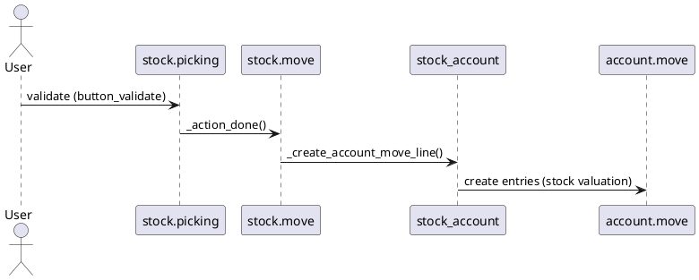

# Stock Account Module (Odoo 18)

> **Summary:** Extends `stock` to post inventory valuation entries automatically and track cost of goods sold (COGS). It bridges stock moves with accounting by creating journal entries per configured accounts.

## 1. Principal components

| Component | File | Responsibilities |
|-----------|------|------------------|
| `stock.valuation.layer` | `addons/stock_account/models/stock_valuation_layer.py` | Records cost layers for moves (used by FIFO/average). |
| `stock.move` overrides | `addons/stock_account/models/stock_move.py` | Hooks into `_create_account_move_line` to generate valuation entries. |
| `stock.valuation.layer.revaluation` | `addons/stock_account/models/stock_valuation_layer.py` | Manual revaluation adjustments. |
| Product category settings | `addons/stock_account/models/product_template.py` | Adds `property_stock_valuation_account_id`, `property_stock_account_input/output`, `inventory_valuation` and `costing_method`. |

## 2. Valuation methods
- **Perpetual valuation**: `inventory_valuation = 'real_time'`. Moves trigger journal entries (stock_input/output accounts and valuation account).
- **Periodic valuation**: `inventory_valuation = 'manual_periodic'`; no auto entries, rely on manual adjustments.
- **Costing:** `standard`, `fifo`, `average`. FIFO uses valuation layers; average recalculates cost on incoming moves.

## 3. Journal entries flow

- Debits/Credits determined by product category accounts.
- For incoming moves (purchase receipt), debit valuation account, credit input account.
- For delivery, credit valuation account, debit output (COGS) account.
- Internal transfers between internal locations produce no entries unless accounting segregation configured.

## 4. Inventory adjustments & revaluation
- Inventory adjustment posting triggers entries (difference vs counted quantity) using expense/gain accounts.
- Manual revaluation wizard (`stock.valuation.layer.revaluation`) adjusts cost and records gain/loss.

## 5. Integration
- **Accounting:** Links to `account.move` and company fiscal settings. Cross-reference with `[[Odoo 18/Core/Processes/Accounting]]`.
- **Manufacturing:** Work orders create consumption/production moves posting valuation entries per BOM cost.
- **Sales/Purchase:** Delivery and receipt flows create COGS and inventory value entries corresponding to invoice flows.

## 6. Configuration
- Product categories: set valuation method, stock accounts.
- Company: define default stock journals. Multi-company ensures separation of accounts.
- Settings: toggle automated inventory valuation in `res.config.settings`.

## 7. To-do (Issue #20)
- [ ] Provide example of valuation journal entry for a delivery (COGS).
- [ ] Document revaluation wizard step-by-step.
- [ ] Link to cost analysis reports when created.

## Navigation
- **Parent:** [[Odoo 18/Community Addons/Inventory/Inventory]]
