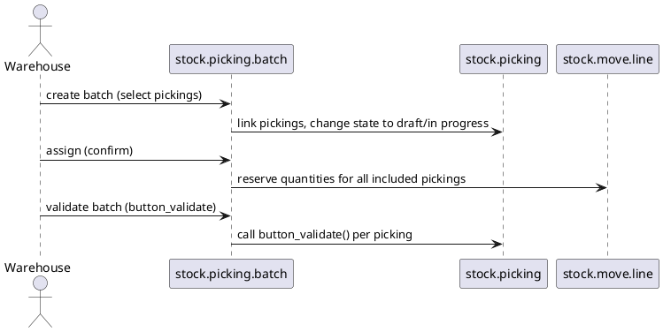

# Batch Picking Module (Odoo 18)

> **Summary:** `stock_picking_batch` allows grouping multiple pickings into a single batch for optimized wave picking. It provides a control panel for batch operations and integrates with barcode flows.

## 1. Principal models

| Model | File | Responsibilities |
|-------|------|------------------|
| `stock.picking.batch` | `addons/stock_picking_batch/models/stock_picking_batch.py` | Represents a batch of pickings; manages state (`draft`, `in_progress`, `done`, `cancel`). |
| `stock.picking` | extended | Gains relation to batch (`batch_id`) and operations for assign/validate from batch. |
| Wizards (`stock.picking.batch.assign`, `stock.picking.batch.print`) | Manage assignment and printing operations. |

## 2. Workflow

- Filters help assign pickings by wave (e.g., same carrier/zone).
- Batch can be cancelled which unlinks pickings and resets reservations.
- Barcode app (if installed) extends UI to scan batches.

## 3. Configuration & usage
- Enable module and use `Inventory > Operations > Batch Transfers`.
- Create batch: select pickings in `Ready` state, choose operation type.
- Print batch picking lists; optional integration with shipping labels (module dependent).

## 4. Integration
- Works with `stock_barcode` (Enterprise) for handheld scanning.
- Interacts with procurement/reservation logic of core inventory.
- Reports last batch processed for analytics (KPIs on picking waves).

## 5. To-do (Issue #20)
- [ ] Document barcode workflow once note exists.
- [ ] Provide example filters for building batches (by carrier/zone).
- [ ] Add reference to Enterprise features (wave picking) if extended modules present.

## Navigation
- **Parent:** `[[Odoo 18/Community Addons/Inventory]]`
- **Related:** `[[Odoo 18/Core/Processes/Inventory]]`, `[[Odoo 18/Community Addons/Inventory/stock.md]]`
- **Issue:** #20 `Docs: Odoo 18 - Community Operations suite`
