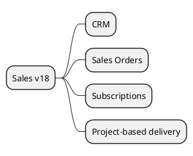

# Sales and CRM v18

## Modules
- `[[Odoo 18/Community Addons/Sales/lead_to_cash.md]]` (flow overview)

- `[[Odoo 18/Community Addons/Sales/crm.md]]`
- `[[Odoo 18/Community Addons/Sales/sale_management.md]]`
- `[[Odoo 18/Community Addons/Sales/sale_subscription.md]]`
- `[[Odoo 18/Community Addons/Sales/sale_project.md]]`

## Actions
- Map pipeline from opportunities to sales.
- Identify integrations with marketing and services.
- Document dashboards and key KPIs.

## Navigation
- **Parent:** [[Odoo 18/Community Addons/Community Addons]]
## Children
- [[Odoo 18/Community Addons/Sales/crm]]
- [[Odoo 18/Community Addons/Sales/lead_to_cash]]
- [[Odoo 18/Community Addons/Sales/sale_management]]
- [[Odoo 18/Community Addons/Sales/sale_project]]
- [[Odoo 18/Community Addons/Sales/sale_subscription]]
