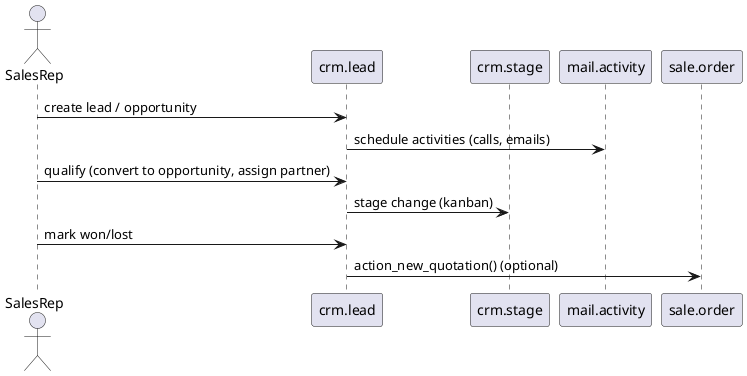

# CRM Module (Odoo 18)

> **Summary:** The `crm` module provides the lead/opportunity pipeline, activity scheduling, scoring, and team management. It is the entry point for the sales funnel before an order is created.

## 1. Principal models

| Model | File | Responsibilities |
|-------|------|------------------|
| `crm.lead` | `addons/crm/models/crm_lead.py` | Lead/opportunity object. Handles stages, team assignment, probability, expected revenue, partner linking, mail activity.
| `crm.stage` | `addons/crm/models/crm_stage.py` | Pipeline stages with sequences, team-specific visibility.
| `crm.team` (`crm.team`, `crm.team.member`) | `addons/crm/models/crm_team.py` | Sales teams, dashboards, member configuration.
| `crm.activity.report`, `crm.lead.scoring.frequency` | Reporting aids for activity logs, scoring automation.

### Related mixins
- `mail.thread`, `mail.activity.mixin`: chatter, activities, scheduled actions.
- `utm.mixin`: marketing source tracking.
- `resource.mixin`: allows assignment to calendar resources for meeting scheduling.

## 2. Lead lifecycle

### Key methods
- `create()`: sets default stage/team, copies phone/email from partner if provided.
- `action_unarchive`, `action_set_lost`, `action_set_won`: update outcome, probability, and schedule follow-ups.
- `_compute_probability`: manual vs automatic probability (`kanban_state`, stage default, scoring).
- `_merge_data`: deduplicate leads; triggered by the merge wizard.
- `_convert_opportunity`: converts lead to opportunity or sale quotation; optionally create new partner.

## 3. Activities & automation
- Mail activities defined via `mail.activity.type`. Default ones: call, email, meeting.
- Automatic scheduling using activity plans (`crm.activity.report`, templates) introduced via configuration wizard.
- Lead scoring optional (module `crm_iap_lead_enrich` uses IAP data).
- Reminder emails/notifications handled with `mail.activity` cron.

## 4. Integrations
- **Sales orders**: `action_new_quotation()` calls `sale.crm` bridge to create quotations (`sale.order`) and log context.
- **Calendar**: meetings can be scheduled directly from opportunity; integration with `calendar.event` via `crm_lead2opp_partner` wizard.
- **Marketing**: UTM fields capture source/medium/campaign; links to Email Marketing/Marketing Automation modules (documented in marketing notes). Leads can be generated from web forms, marketing campaigns.
- **Helpdesk/Support**: conversions between tickets and opportunities when modules installed (e.g. `helpdesk_sale`).
- **Website**: `website_crm` collects leads from contact forms.
- **VoIP**: optional `crm_voip` extends activities with telephony.

## 5. Pipeline views & configuration
- Kanban view grouped by stage; `probability` progress bar; manual weighting vs stage default.
- Stage flags: `fold` (hide when empty), `sequence`, `team_id` (stage per team), `is_won` / `is_lost`.
- Multi teams: `crm.team` allows dashboards, planning, and customizing targets (monthly invoicing, activities).
- Example configuration path: _CRM > Configuration > Settings_ toggles leads vs opportunities, multi-teams, lead scoring, recurrences.

## 6. Reporting
- Built-in dashboards use SQL views (`crm.team.report`, `crm.lead.report`) aggregated by stage, probability, and expected revenue.
- Pivot/graph views track conversions, open vs won values.
- Activity reporting uses `crm.activity.report` to ensure timely follow-ups.

## 7. Cross-links
- `[[Odoo 18/Core/Processes/Sales]]`  opportunities feed sales orders.
- `[[Odoo 18/Core/Master Data/res_partner.md]]`  partner matching, warnings.
- `[[Odoo 18/Core/Master Data/res_users.md]]`  sales teams and user permissions.
- Marketing modules under `[[Odoo 18/Community Addons/Marketing]]` for campaigns and automation.

## 8. To-do (Issue #18)
- [ ] Document lead enrichment/IAP integration steps.
- [ ] Provide example of lead conversion to quotation (RPC payload).
- [ ] Link to website form generation once documented.

## Navigation
- **Parent:** [[Odoo 18/Community Addons/Sales/Sales]]
