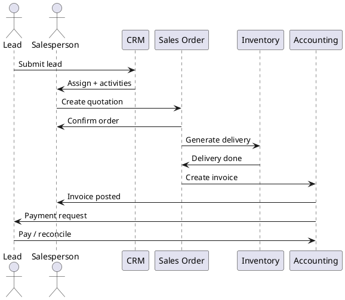

# Lead-to-Cash Flow (Sales CE)

> **Summary:** Describes the standard journey from marketing lead to posted invoice in Odoo 18 Community Edition. It consolidates CRM, Sales Orders, Deliveries, and Accounting into a single perspective with references to the underlying modules.

## Overview
1. **Lead capture** (`crm.lead`): marketing forms, manual entries, or lead mining create leads assigned to sales teams.
2. **Qualification**: convert to opportunity, schedule activities, and estimate revenue. Links to `[[Odoo 18/Community Addons/Sales/crm.md]]`.
3. **Quotation** (`sale.order` draft): using products from `[[Odoo 18/Core/Master Data/product_template.md]]`, pricelists, and fiscal positions. Optional features like quotation templates and optional products apply here.
4. **Confirmation**: `action_confirm` spawns delivery orders (`stock.picking`) and/or projects/subscriptions depending on line configuration.
5. **Delivery**: stock moves reserve and transfer goods. Services may generate timesheets or subscriptions.
6. **Invoicing**: advance or final invoices create `[[Odoo 18/Core/Processes/Accounting/account_move.md]]` records.
7. **Payment**: `account.payment` reconciles entries and updates customer statements.

## Module touchpoints
- CRM (`crm`): lead, opportunity, pipeline stages.
- Sales (`sale_management`): quotations, pricing, up-selling.
- Inventory (`stock`): delivery orders, availability checks.
- Accounting (`account`): invoices, journal entries, reconciliation.
- Portal (`portal`, `sale_portal`): customer self-service for quotations and invoices.

## Data dependencies
- Partners: `[[Odoo 18/Core/Master Data/res_partner.md]]`
- Products & variants: `[[Odoo 18/Core/Master Data/product_template.md]]`, `[[Odoo 18/Core/Master Data/product_product.md]]`
- Units of measure: `[[Odoo 18/Core/Master Data/uom_uom.md]]`
- Taxes & accounts: `[[Odoo 18/Core/Processes/Accounting/account_move.md]]`

## Infrastructure hooks
- Reports: quotation and invoice documents rely on `[[Odoo 18/Core/Infrastructure/Reports.md]]`.
- Real-time updates: salesperson notifications travel via `[[Odoo 18/Core/Infrastructure/Bus.md]]`.
- Attachments: signed quotations and invoices stored through `[[Odoo 18/Core/Infrastructure/Files.md]]`.
- Security: record rules govern salesperson visibility (`[[Odoo 18/Core/Infrastructure/Security.md]]`).

## Related documentation
- `[[Odoo 18/Core/Processes/Sales]]`
- `[[Odoo 18/Community Addons/Sales/sale_management.md]]`
- `[[Odoo 18/Community Addons/Finance/invoice_to_cash.md]]`
- `[[Odoo 18/Community Addons/Inventory]]`

## Navigation
- **Parent:** [[Odoo 18/Community Addons/Sales/Sales]]
