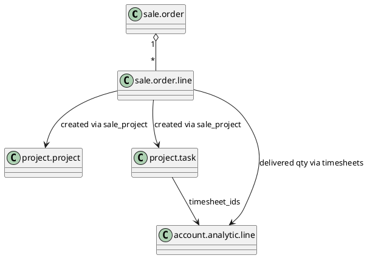

# Sale Project Module (Odoo 18)

> **Summary:** `sale_project` bridges sales orders with project delivery. When service products require project/task creation (`service_tracking`), this module ensures projects and tasks are generated automatically and linked to sales for billing and planning.

## 1. Key behaviours

| Trigger | Outcome |
|---------|---------|
| Sale order confirmation (`sale.order.action_confirm`) with products `service_tracking = project_only` | Creates a new `project.project` using template or default project per product. |
| Products `service_tracking = task_global_project` or `task_in_project` | Create tasks in existing project(s) or create a new project depending on configuration. |
| Deliverable tracked by timesheets | Delivered quantity computed from `account.analytic.line` entries associated to generated tasks. |

### Main methods (in `addons/sale_project/models/sale_order.py`)
- `_create_project_from_template`: duplicates template project with stages/tasks when sale confirmed.
- `_create_project`: creates blank project with partner, company, planned hours.
- `_create_task`: creates tasks per order line, assigns followers/users.
- `_timesheet_service_generation`: connects timesheet logging to sale order line.
- `_prepare_project_vals` / `_prepare_task_vals`: gather values including analytic account, privacy, tags.

## 2. Data model

## 3. Configuration
- Product fields: `service_tracking`, `service_policy`, `project_id`, `project_template_id`, `project_variant_ids`.
- Settings (`res.config.settings`): defaults for new projects, enable timesheets on sales orders.
- Templates: stage/task templates via `project.project` template feature if installed.

## 4. Integration
- **Timesheets:** with `sale_timesheet`, analytic lines logged on tasks update `qty_delivered_method = timesheet`. Drives invoicing (T&M).
- **Accounting:** delivered quantities push to `account.move` lines when invoicing method is `delivered quantities`.
- **Helpdesk/Field service:** expansions allow routing tasks to helpdesk tickets or field interventions.
- **Subscriptions:** recurring services can create recurring tasks per invoice cycle.

## 5. To-do (Issue #18)
- [ ] Provide concrete examples of product configurations (project vs task vs global project).
- [ ] Document interplay with `project_template` (Enterprise) when duplicating stages.
- [ ] Link to timesheet billing notes once drafted.

## Navigation
- **Parent:** `[[Odoo 18/Community Addons/Sales/Index]]`
- **Related:** `[[Odoo 18/Core/Processes/Sales/Index]]`, `[[Odoo 18/Core/Processes/Projects/Index]]`, `[[Odoo 18/Community Addons/Services/Index]]`
- **Issue:** #18 `Docs: Odoo 18 - Community Sales suite`
