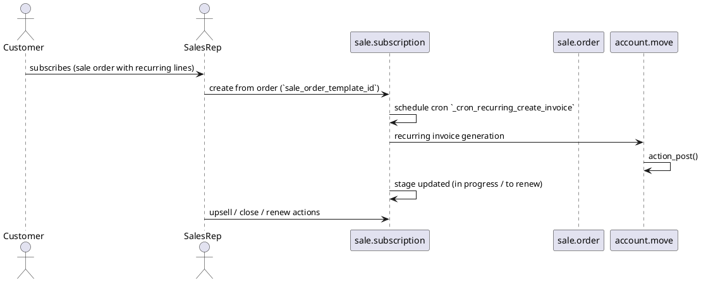

# Sale Subscription Module (Odoo 18)

> **Summary:** The `sale_subscription` module introduces recurring contracts (subscriptions) with automated invoicing, upsell management, and churn metrics. It sits on top of `sale_management`, `account`, and optional services projects/timesheets.

## 1. Principal models

| Model | File | Responsibilities |
|-------|------|------------------|
| `sale.subscription` | `addons/sale_subscription/models/sale_subscription.py` | Subscription contract containing recurring lines, billing periods, stage, next invoice date.
| `sale.subscription.line` | `addons/sale_subscription/models/sale_subscription.py` | Line items with product, price, recurrence (`qty`, `uom`, `recurrence_id`).
| `sale.subscription.stage` | Stage management (kanban) for subscriptions (e.g., `In Progress`, `To Renew`, `Closed`).
| Wizards (`sale.subscription.close`, `sale.subscription.renew`, `sale.subscription.modify`) | Manage cancellations, renewals, plan changes.

## 2. Lifecycle & automation

- Subscriptions typically originate from sale orders with products flagged `service_policy = prepaid` and `recurring_invoice`. Templates (`sale_subscription.template`) define default recurrence, invoicing intervals, churn warnings.
- Cron job `_cron_recurring_create_invoice` (scheduled daily) issues invoices when `next_invoice_date <= today`, handles proration.
- Stage automation sets `to_renew` flag when approaching end date; closing unsubscribes future invoices.

## 3. Pricing & renewals
- Subscription lines support multiple recurrence units (`daily`, `weekly`, `monthly`, `yearly`) via `recurrence_id` and `recurrence_count`.
- Upsell wizard creates incremental sale orders to extend contracts (`sale_subscription.modify`), adjusting billing lines.
- Renewal wizard (`sale_subscription.renew`) clones subscription into new contract (optional).
- Discounts/prorations computed via `price_subtotal` and recurring formula; optional autopay depending on `account_payment` modules.

## 4. KPIs & reporting
- Metrics: `recurring_monthly`, `recurring_yearly`, `mrr`, `recurring_total`, `recurring_next_month` fields aggregate revenue.
- Churn tracking: `close_reason_id`, `to_renew`, `stage_id`. Reports via `sale.subscription.report`.
- Dashboards highlight `MRR`, `NRR`, `Churn Rate`; Kanban for stage visuals.

## 5. Integrations
- **Accounting:** Invoices posted to `account.move`; auto-payment possible with payment providers; see `[[Odoo 18/Core/Processes/Accounting/Index]]`.
- **Projects/Timesheets:** Optionally link to `project.project`/`task` for service delivery; integration with `sale_timesheet` for subscription projects.
- **Portal:** Customers manage subscriptions via portal (`sale_subscription_portal`).
- **Helpdesk:** `helpdesk_sale_subscription` connects support contracts to subscriptions for SLA.
- **Website:** SaaS flow with `website_sale_subscription` enabling checkout and plan management.

## 6. Configuration
- Settings: enable automatic invoicing, portal management, recurrence options in `res.config.settings`.
- Templates define default plans, email templates, recurrence; accessible under _Subscriptions > Configuration > Plans_.
- Billing per period vs advance; company-specific configuration (auto-close at EoL) stored via `ir.config_parameter`/`res.company`.

## 7. To-do (Issue #18)
- [ ] Document website/portal flows in detail when those notes exist.
- [ ] Provide example cron output / logs for recurring invoicing.
- [ ] Describe integration with payment tokens (if enterprise modules allow autopay).

## Navigation
- **Parent:** `[[Odoo 18/Community Addons/Sales/Index]]`
- **Related:** `[[Odoo 18/Core/Processes/Sales/Index]]`, `[[Odoo 18/Community Addons/Sales/sale_management.md]]`, `[[Odoo 18/Core/Processes/Accounting/Index]]`
- **Issue:** #18 `Docs: Odoo 18 - Community Sales suite`
