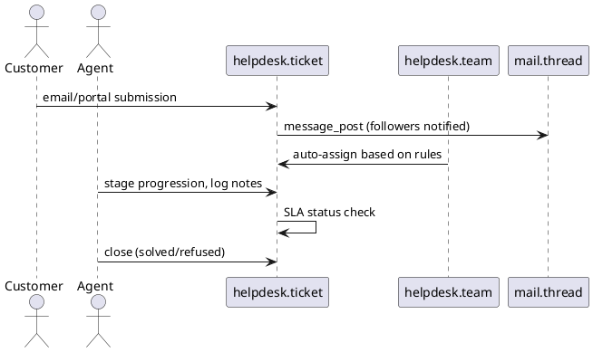

# Helpdesk Module (Odoo 18)

> **Summary:** Provides a ticketing pipeline for customer support. Integrates with email gateway, portal, knowledge base, and can spawn tasks/projects.

## 1. Principal models

| Model | File | Responsibilities |
|-------|------|------------------|
| `helpdesk.ticket` | `addons/helpdesk/models/helpdesk_ticket.py` | Tickets with stages, assigned user/team, SLA info.
| `helpdesk.team` | `addons/helpdesk/models/helpdesk_team.py` | Support teams with configuration for channels, portal, satisfaction.
| `helpdesk.sla` | `addons/helpdesk/models/helpdesk_sla.py` | SLA policies for response/closing times (Native in CE). |
| Wizards (`helpdesk.ticket.merge`, etc.) | Manage merges, assignment, stage transitions.

## 2. Ticket lifecycle

### Features
- Multi-channel intake: email aliases, website form, portal submission.
- SLA: response time tracking (`helpdesk.sla`) with automated failure actions (e.g., escalation). Stage-based policies.
- Knowledge integration (`knowledge` module) optional references for solutions.
- Satisfaction surveys (Enterprise)  mention as optional extension.

## 3. Configuration
- Teams configure channels, default stages, email alias, portal settings.
- Tags categorize tickets; `priority` field for star rating.
- Activities used for follow-ups; scheduled actions remind agents of due SLAs.

## 4. Integrations
- **Projects:** button to create project tasks from tickets (when `project` installed) for longer work.
- **Sales:** optionally create opportunities/quotations for upsell (`helpdesk_sale`).
- **Field Service:** integration to dispatch field interventions (Enterprise modules).
- **Timesheets:** log time on tickets if `helpdesk_timesheet` installed.

## 5. Reporting
- Dashboards for ticket counts, SLA compliance, satisfaction (if enabled).
- `helpdesk.ticket.report` provides pivot/graph analytics by team, stage, priority.

## 6. To-do (Issue #21)
- [ ] Document SLA failure actions in detail with examples.
- [ ] Provide JSON example of ticket creation via email/portal.
- [ ] Clarify interplay with Enterprise features (knowledge, field service) in dedicated notes.

## Navigation
- **Parent:** `[[Odoo 18/Community Addons/Services]]`
- **Related:** `[[Odoo 18/Community Addons/Services/project.md]]`, `[[Odoo 18/Core/Master Data/res_users.md]]`, `[[Odoo 18/Core/Processes/Projects]]`
- **Issue:** #21 `Docs: Odoo 18 - Community Services suite`
