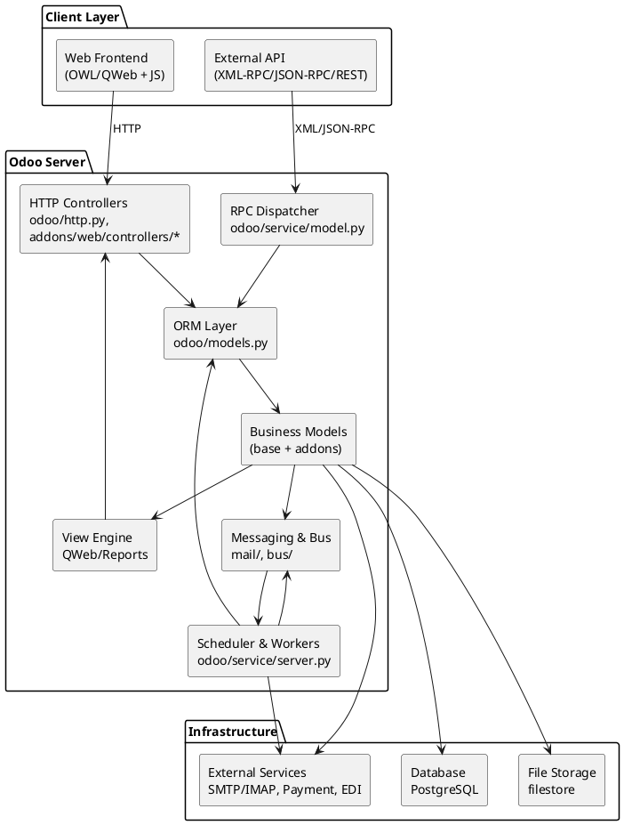
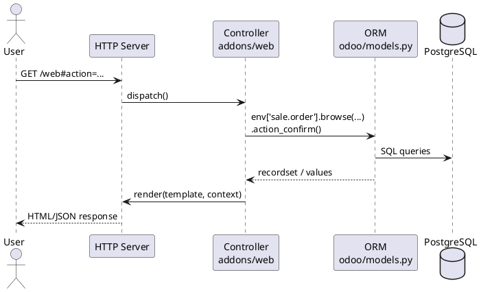

# Odoo 18 Core Architecture

> _How does Odoo behave internally?_ This note summarises the main building blocks of the Odoo 18 core as inferred from the source code. Use it as the “table of contents” for the deeper notes found throughout `Odoo 18/Core`.

## 1. Component map

### Key packages
- `odoo/http.py`, `addons/web/controllers/*`: HTTP layer and session management.
- `odoo/service/model.py`, `odoo/service/db.py`: RPC endpoints and database services.
- `odoo/models.py`, `odoo/fields.py`, `odoo/api.py`: ORM/field descriptors/decorator semantics.
- `odoo/addons/base/models/*`: reference master data (partners, users, currencies, companies).
- `addons/web`, `addons/bus`, `addons/mail`: UI assets, long-polling bus, threaded messaging.
- `odoo/tools/*`, `odoo/osv/*`: utility and legacy helpers used by the ORM.

## 2. Startup and module loading
1. **Bootstrap (`odoo-bin`)** – `odoo/cli/server.py` parses CLI arguments, configures logging, chooses “server” or “shell” mode.
2. **Registry initialisation** – `odoo/modules/registry.py` builds a per-database registry with metadata about installed modules.
3. **Module graph resolution** – `odoo/modules/loading.py` reads manifests (`__manifest__.py`), resolves dependencies, loads Python files, XML/CSV data, security rules, wizards, and views.
4. **Hooks & Inheritance** – models declared with `_inherit` or `_name` extend/override behaviour dynamically; the registry keeps method dispatch tables updated.
5. **Workers** – `odoo/service/server.py` spawns multiprocess workers or threaded servers depending on configuration.

_Follow-up notes_: see `[[Templates/Module Documentation Template]]` for the expected structure when documenting individual modules discovered in step 3.

## 3. Request lifecycle (HTTP)

1. **WSGI entry**: `odoo/service/wsgi_server.py` passes the request to `odoo/http.py`.
2. **Dispatch**:
   - Session & authentication middleware (`odoo/http.py:Session`) ensures correct user/DB context.
   - Routes defined via `@http.route` (e.g., `addons/web/controllers/home.py`) handle the endpoint.
3. **Controller logic** interacts with the ORM (`request.env['model']`) executing business rules.
4. **Response generation**:
   - HTML: rendered by QWeb templates (`addons/web/views/*`).
   - JSON: typically returned for RPC (`/web/dataset/call_kw`) requests.
5. **Post-commit hooks** (bus notifications, mail queue, etc.) are triggered via the registry.

### Sequence diagram (simplified)

## 4. ORM overview
- **Model** classes inherit from `BaseModel` (defined in `odoo/models.py`). Fields are descriptors from `odoo/fields.py`.
- **Environment (`env`)**: wraps cursor, user, context; created per request or job (`odoo/api.Environment`).
- **Decorators**: `@api.model`, `@api.depends`, `@api.constrains`, `@api.onchange` control method semantics.
- **Recordsets**: every query returns a recordset (lazy iterator). Operations (`mapped`, `filtered`, batch writes) are vectorised.
- **Internationalisation**: context keys (like `lang`) influence computed fields and view rendering.
- **Security**: access rules enforced in `_check_field_access_rights`, `ir.model.access`, `ir.rule`, `sudo()` semantics.

_Related notes_: `[[Odoo 18/Core/Master Data/res_partner.md]]`, `[[Odoo 18/Core/Infrastructure/ORM.md]]`.

## 5. Cross-cutting services
- **Messaging (`mail.thread`, `mail.activity`)**: mixins provide chatter, followers, activities. Uses bus notifications via `addons/mail` and `addons/bus`.
- **Scheduler (`ir.cron`)**: records in database executed by worker threads; defined in XML data (`data/ir_cron.xml`).
- **Reports/QWeb**: `odoo/addons/base/models/ir_actions_report.py`, `report.py` handle PDF/HTML rendering.
- **Assets bundling**: managed by `addons/web/controllers/main.py` and asset bundles defined in manifest `assets` sections.
- **Security & auth**: `res.users`, `ir.model.access`, `auth_*` modules (TOTP, LDAP, OAuth) hook into login pipeline.
- **Integrations**: SMTP/IMAP (`fetchmail`), payment providers, EDI connectors sit in dedicated modules (documented under `Odoo 18/Core/Integrations`).

## 6. Navigating the documentation

| Area | Notes |
|------|-------|
| Framework | `[[Odoo 18/Core/Framework/Index]]` (Base/Web/Mail/Auth) |
| Master Data | `[[Odoo 18/Core/Master Data/Index]]` (partners, products, users, companies, currency) |
| Processes | `[[Odoo 18/Core/Processes/Index]]` (Accounting, Inventory, Sales, Purchasing, Projects, HR, Manufacturing) |
| Infrastructure | `[[Odoo 18/Core/Infrastructure/Index]]` (ORM internals, reports, files, bus, security) |
| Integrations | `[[Odoo 18/Core/Integrations/Index]]` (Mail, Web Services, Payments, External Systems) |

Every folder has its own `Index.md`, and each note ends with a `## Navigation` block to help Obsidian’s graph display parent/child relationships.

## 7. Open questions
- Document the exact registry loading order (hook sequencing) – to be covered under `Odoo 18/Core/Infrastructure/Index`.
- Benchmark worker configurations (multiprocessing vs threading) – add to a future `Ops` note.
- Capture how enterprise web client assets modify base behaviour (see Odoo 18 Enterprise Digital notes).

## Navigation
- **Parent:** `[[Odoo 18/Core/Index]]`
- **Related:** `[[Odoo 18/Core/Framework/Index]]`, `[[Odoo 18/Core/Master Data/Index]]`, `[[Odoo 18/Core/Processes/Index]]`, `[[Odoo 18/Core/Infrastructure/Index]]`, `[[Odoo 18/Core/Integrations/Index]]`
- **Issue:** #16 `Docs: Odoo 18 - Core architecture overview`
