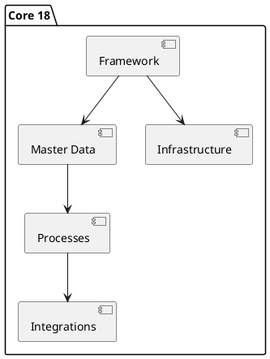

# Odoo 18 Core

## Key areas
- Core architecture overview -> `[[Odoo 18/Core/Architecture.md]]`
- Base framework (`base`, `web`, `mail`) -> `[[Odoo 18/Core/Framework]]`
- Master models (`partner`, `product`, `uom`, `company`) -> `[[Odoo 18/Core/Master Data]]`
- Backbone processes (`account`, `stock`, `project`, `hr`) -> `[[Odoo 18/Core/Processes]]`
- Technical infrastructure (ORM, bus, reports) -> `[[Odoo 18/Core/Infrastructure]]`
- Platform-level integrations -> `[[Odoo 18/Core/Integrations]]`

## Initial checklist
- [x] Catalog master data essentials (`res.partner`, `product.template`, `account.move`).
- [ ] Create UML diagrams of the most popular models.
- [ ] Document key ORM adaptations.

## Next suggested notes
- `[[Odoo 18/Core/Framework/Base.md]]`
- `[[Odoo 18/Core/Framework/Web.md]]`
- `[[Odoo 18/Core/Master Data/res_partner.md]]`
- `[[Odoo 18/Core/Infrastructure/ORM.md]]`
- `[[Odoo 18/Core/Integrations/Web Services.md]]`

## Navigation
- **Parent:** [[Odoo 18/Odoo 18]]
## Children
- [[Odoo 18/Core/Architecture]]
- [[Odoo 18/Core/Framework/Framework]]
- [[Odoo 18/Core/Infrastructure/Infrastructure]]
- [[Odoo 18/Core/Integrations/Integrations]]
- [[Odoo 18/Core/Master Data/Master Data]]
- [[Odoo 18/Core/Processes/Processes]]
