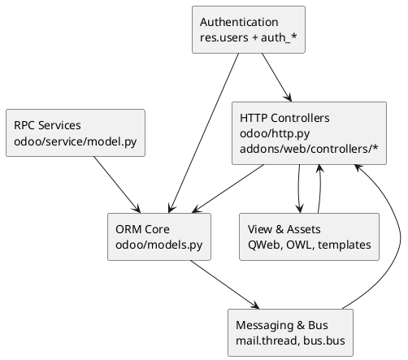

# Core Framework v18

The framework layer acts as the glue between HTTP/RPC entry points, the ORM, the UI asset pipeline, and horizontal services such as messaging and authentication. This note summarises the architecture and points to detailed component notes.

## Module layout
- **Base services:** `odoo/models.py`, `odoo/fields.py`, `odoo/api.py`, `odoo/tools/*`.
- **HTTP & RPC:** `odoo/http.py`, `odoo/service/model.py`, `addons/web/controllers/*`.
- **Web assets & client:** `addons/web`, `addons/web_editor`, `addons/base/static`.
- **Messaging:** `addons/mail`, `addons/bus`, `odoo/addons/base/models/ir_mail_server.py`.
- **Authentication:** `addons/auth_*` (signup, totp, ldap, oauth), `odoo/addons/base/models/res_users.py`.

## Component map

## Request & RPC pipeline
1. **Inbound** via WSGI -> `odoo/http.py:Root` dispatches to the right database and session.
2. **Routing** handled by `@http.route` decorators; backend RPC uses `/web/dataset/call_kw`.
3. **Environment creation** (`request.env`) ties together cursor, user, and context.
4. **ORM invocation** executes business logic, triggers computed fields, and enforces security ACLs.
5. **Response** rendered through QWeb/JSON; bus notifications queued for realtime updates.

## Base services
- **ORM**: vectorised recordsets, decorators (`@api.depends`, `@api.model`), automatic invalidation.
- **Fields**: descriptors in `odoo/fields.py` enforce type coercion, relations, inverse methods.
- **Registry**: `odoo/modules/registry.py` manages per-database metadata and module inheritance.
- **Tools**: utilities in `odoo/tools` (SQL helpers, misc, translate, config) shared across modules.

## Web layer and assets
- Controllers in `addons/web/controllers` serve the backend UI and assets manifest.
- Asset bundles defined in module manifests (`assets` key) drive SCSS/JS compilation.
- OWL components (v18 hybrid) render dynamic UI; server-side QWeb still handles primary page shells.
- Web client communicates with `/web/webclient/*`, bus long-polling, and dataset RPC endpoints.

## Messaging and notification pipeline
- `mail.thread` mixin attaches chatter to models, relying on `mail.message`, `mail.followers`.
- Realtime updates use `bus.bus` long-polling (see `addons/bus/controllers/main.py`).
- Email gateway orchestrated via `mail.mail`, SMTP/IMAP connectors, and scheduled jobs.

## Authentication & security
- Core login handled in `odoo/addons/base/controllers/portal.py` and `odoo/http.py`.
- Extra providers (OAuth, LDAP, TOTP, signup) extend `res.users` and controller flows.
- Access control enforced via `ir.model.access`, record rules (`ir.rule`), and environment context.
- Password policies (`res.users._check_credentials`) and API tokens (`res.users.apikey`) live here.

## Extension points
- Model inheritance (`_inherit`, `_name`) allows modules to extend framework behaviour.
- Controllers can be overridden or monkey-patched using class inheritance and `@http.route` priority.
- Assets pipeline supports overriding templates and JS components via `qweb`/`assets` declarations.

## Checklist / next steps
- [ ] Document each sub-component note (`Base`, `Web`, `Mail`, `Auth`) with method-level detail.
- [ ] Capture OWL/QWeb interaction specifics in `[[Odoo 18/Core/Framework/Web.md]]`.
- [ ] Add examples of controller overrides and RPC payloads.
- [ ] Compare v18 vs v19 framework changes in `[[Comparisons/Core ORM]]`.

## Navigation
- **Parent:** `[[Odoo 18/Core]]`
- **Children:**
  - `[[Odoo 18/Core/Framework/Base.md]]`
  - `[[Odoo 18/Core/Framework/Web.md]]`
  - `[[Odoo 18/Core/Framework/Mail.md]]`
  - `[[Odoo 18/Core/Framework/Auth.md]]`
- **Issue:** #17 `Docs: Odoo 18 - Framework overview`

## Children
- [[Odoo 18/Core/Framework/Auth]]
- [[Odoo 18/Core/Framework/Base]]
- [[Odoo 18/Core/Framework/Mail]]
- [[Odoo 18/Core/Framework/Web]]