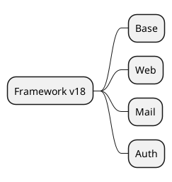

# Core Framework v18

## Base modules
- `[[Odoo 18/Core/Framework/Base.md]]`
- `[[Odoo 18/Core/Framework/Web.md]]`
- `[[Odoo 18/Core/Framework/Mail.md]]`
- `[[Odoo 18/Core/Framework/Auth.md]]`

## Initial tasks
- Document ORM architecture and basic services.
- Map extension points and hooks.
- Register common customizations detected in projects.

## Navigation
- **Parent**: `[[Odoo 18/Core/Index]]`
- **Children**:
  - `[[Odoo 18/Core/Framework/Base.md]]`
  - `[[Odoo 18/Core/Framework/Web.md]]`
  - `[[Odoo 18/Core/Framework/Mail.md]]`
  - `[[Odoo 18/Core/Framework/Auth.md]]`

