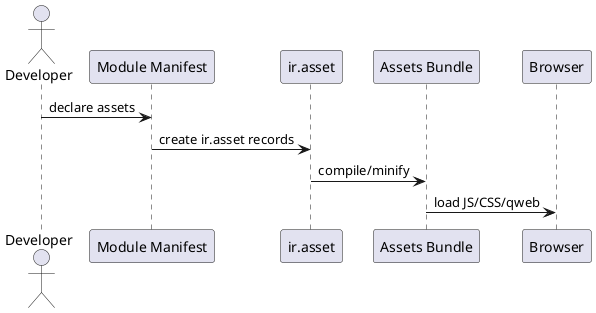
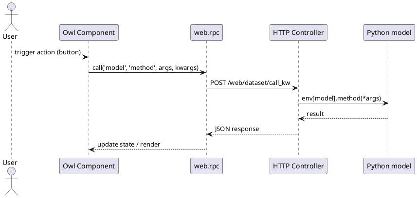

# Web Framework & Frontend Architecture (Odoo 18)

> **Summary:** The `web` module powers the backend web client and assets pipeline. This note explains how assets are bundled, how QWeb and Owl interact, the JavaScript module system, and how to extend the UI.

## 1. Component overview

| Layer | Components | Notes |
|-------|------------|-------|
| Backend web client | Owl root (`web_client`), legacy widgets (`web.Class`), action manager, services | Provides main UI for backend users. Live in `addons/web/static/src`. |
| Templating | QWeb (server & client side) | Server renders HTML via `ir.ui.view`; client uses compiled templates for dialogs/report fragments. |
| Assets bundler | `web.assets_backend`, `web.assets_frontend`, `web.assets_common`, `web.assets_qweb` | Defined via manifest `assets` section and `ir.asset` records; compiled by `AssetsBundle`. |
| RPC layer | `web.rpc`, `session.rpc`, `ajax`, `action_manager` | Communicate with Python controllers (`/web/dataset/call_kw`). |
| Bus & notifications | `bus.BusService`, `mail.notification_service` | Real-time updates (chatter, activities). |

## 2. Assets pipeline
- Module manifests (`__manifest__.py`) define bundles under `assets` key. Example:
  ```python
  'assets': {
      'web.assets_backend': [
          'my_module/static/src/js/mymodule.js',
          'my_module/static/src/scss/styles.scss',
      ],
      'web.assets_qweb': [
          'my_module/static/src/xml/**/*.xml',
      ],
  }
  ```
- Bundles compiled by `ir.asset` using SCSS/JS minifier (via `libsass` and `babel`/`uglify`).
- Backend vs Frontend:
  - `web.assets_backend`: loaded in web client (form/list views).
  - `web.assets_frontend`: website portal/public pages.
  - `web.assets_common`: shared libs (Underscore, moment, Owl runtime).
  - `web.assets_qweb`: client-side QWeb templates compiled to JS.
- Asset rebuild triggered when debug assets (`?debug=assets`) or on server restart if `--dev=assets`.

### Asset bundling diagram


## 3. JavaScript module system
- Modern modules use ES6 + Owl with `/** @odoo-module */` header; bundler wraps for AMD loader.
- Legacy `odoo.define('module', function (require) { ... })` still supported.
- Main loader: `odoo-loader.js` with `require('web.core')`, `require('web.rpc')`.
- Owl components: define `static template = 'Module.Template'`; use hooks `useService`, `useBus`.
- Service registry located in `web.service_registry`; register custom service via `registry.category('services').add('my_service', factory)`.

## 4. Templating (QWeb vs Owl)
- **Server-side QWeb** (`ir.ui.view`): used for web client layout, forms, reports.
- **Client-side QWeb**: templates compiled to JS for dialogs, lists, etc.
- **Owl**: component-based rendering inside web client (control panel, form renderer). Templates stored in XML and referenced by component.
- To extend UI:
  - Inherit QWeb view with `<xpath>` from XML.
  - Patch Owl component via `patch` utility or `registry.category('fields').add()` for field widgets.

## 5. RPC & action flow


## 6. Backend vs Frontend extensions
- **Backend**: extend views, widgets, services in `web.assets_backend`.
- **Frontend**: extend website controllers/templates; put assets in `web.assets_frontend`.
- Portal pages often use both (frontend layout + backend models via RPC).

## 7. Developer tips
- Enable developer mode > Assets to inspect bundles.
- Use `?debug=tests` to load OWL component test env.
- Use `console.log(env.services)` to inspect available services.
- Remember to update translations for JS strings using `odoo.__` helpers and `--i18n-extension` options.

## 8. To-do (Frontend deep dive)
- [ ] Document Owl component lifecycle (hooks, patching) with examples.
- [ ] Explain how to add custom field widgets and list views.
- [ ] Cover website/portal asset overrides (scss/js) and caching.
- [ ] Reference v19 frontend changes (Owl v2) in `[[Comparisons/Core ORM]]` follow-up note.

## Navigation
- **Parent:** `[[Odoo 18/Core/Framework]]`
- **Related:** `[[Odoo 18/Core/Processes/Sales]]`, `[[Odoo 18/Core/Infrastructure]]`, `[[Odoo 18/Core/Architecture.md]]`
- **Issue:** #17 `Docs: Odoo 18 - Framework overview`
