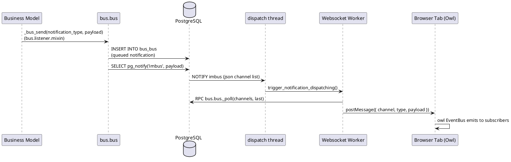

# Real-time Bus & Notification Stack (Odoo 18)

> **Summary:** The `bus` add-on provides the push-notification backbone for Odoo's UI. It couples database-backed channels with long-polling and websocket transport so that modules (e.g., `mail`, `discuss`, `queue_job`) can broadcast events to every connected browser tab.

## Component inventory
| Layer | Implementation | Location | Responsibilities |
|-------|----------------|----------|------------------|
| Data model | `bus.bus` (`ImBus`) | `addons/bus/models/bus.py` | Persists notifications until delivery; handles pre/post-commit hooks and PostgreSQL `NOTIFY` integration. |
| Dispatcher thread | `ImDispatch` + `dispatch` singleton | `addons/bus/models/bus.py` | Listens to `LISTEN imbus` and fans out notifications to subscribed websockets. |
| HTTP long-polling | `/longpolling/poll` (in `odoo/addons/bus/controllers/main.py`) | WSGI | REST fallback for clients that cannot use websockets. |
| Websocket server | `addons/bus/websocket.py` | Standalone gevent app | Manages websocket lifecycle, authentication, and dispatch to tabs; shares `dispatch` with long-polling. |
| Client worker | `@bus/workers/websocket_worker` | `addons/bus/static/src/workers` | SharedWorker coordinating a single websocket per browser. |
| Client service | `bus_service` | `addons/bus/static/src/services/bus_service.js` | Owl service wrapping worker events, reconnect logic, channel subscription API. |
| Presence tracking | `bus.presence` | `addons/bus/models/bus_presence.py` | Maintains user status (online/away/offline), episodes triggered during polls. |
| Convenience mixin | `bus.listener.mixin` | `addons/bus/models/bus_listener_mixin.py` | Simplifies publishing model-scoped notifications (`record._bus_send(...)`). |

## Runtime architecture
### Server-side flow
- Business code calls `_bus_send()` (via `bus.listener.mixin`) or `env['bus.bus']._sendone(...)`, queuing a payload in `self.env.cr.precommit.data`.
- Post-commit hook pushes the message into PostgreSQL using `pg_notify('imbus', payload)` (configurable via `ODOO_NOTIFY_FUNCTION`, `ODOO_NOTIFY_PAYLOAD_MAX_LENGTH`).
- `ImDispatch` thread (daemon) listens to the `imbus` channel, loads pending messages from `bus_bus`, and signals subscribed websocket instances.
- The long-polling controller queries the table when clients call `/longpolling/poll`, filtering by `channel` and `last` notification id.
- Websocket connections run inside `addons/bus/websocket.py`, authenticating sessions with `check_session`, then asking `dispatch` to subscribe to channels; when `dispatch` receives a payload it invokes `websocket.trigger_notification_dispatching()`.

### Communication protocol
- Channels are tuples anchored to the database name: `(dbname, 'res.partner', 42)` or `(dbname, 'mail.channel', 17, 'typing')`. Conversion happens through `channel_with_db()` to guarantee uniqueness across multi-database deployments.
- Messages are JSON objects with a `type` and `payload` key. The client bus service routes them to registered listeners keyed by channel string.
- The notification table is garbage-collected by `ImBus._gc_messages()` (autovacuum decorated) using `bus.gc_retention_seconds` (default 24h).

## Sequence (model to browser)

## Client mechanics
- **Shared connectivity:** `bus_service` prefers a `SharedWorker`, falling back to a dedicated worker when required (iOS, private browsing). Connection state is exposed through Owl events (`connect`, `reconnect`, `disconnect`).
- **Channels & listeners:** Tabs call `bus_service.addChannel(channel)` and `busService.on(channel, (payload) => ...)`. Internally, the worker keeps an incremental `last_notification_id` to detect missed messages via `/bus/has_missed_notifications`.
- **Cross-tab hygiene:** `multi_tab_service` prevents duplicate notifications; `assets_watchdog_service` and `outdated_page_watcher_service` react to version drift or tab staleness.
- **Presence updates:** `presence_service` fires RPCs to maintain `bus.presence`, which in turn publishes updates that `mail` uses to color avatars.

## Configuration & deployment
- Command-line: start gevent longpolling with `odoo-bin --workers=N --longpolling-port=8072`. When `workers > 0`, Odoo forks an additional gevent process dedicated to longpolling/websockets (`PreforkServer.long_polling_spawn()`).
- Environment tuning:
  - `ODOO_NOTIFY_FUNCTION`: replace `pg_notify` with a custom stored function (e.g., to relay to external brokers).
  - `ODOO_NOTIFY_PAYLOAD_MAX_LENGTH`: cap for JSON payload before splitting (default 8000 bytes).
  - `bus.gc_retention_seconds`: controls the retention window for queued messages.
  - Reverse proxies must forward `Upgrade: websocket` headers to the longpolling port.
- High availability: bus relies on PostgreSQL notifications; in multi-worker deployments each worker joins the same `dispatch` thread. External message brokers (Redis, RabbitMQ) are not required but can be integrated by overriding `_sendone` or the dispatch thread.

## Extension patterns
- **Model notifications:** inherit `bus.listener.mixin`, implement `_bus_channel` when the channel is different from the record itself, and call `self._bus_send('reload', {...})` post-write.
- **Transitional subchannels:** pass `subchannel='typing'` to differentiate event types while keeping access rules on the main record.
- **Background workers:** queue jobs may publish progress through `_bus_send` so the UI can stream progress bars (common in `queue_job` add-on).
- **Bridging to Owl models:** register a service consumer in `@web/core/registry` and forward bus payloads to store managers (see `mail/static/src/models` for examples).

## Observability & reliability
- Logs: server uses the `odoo.addons.bus` logger for transport issues and the `longpolling` logger for gevent loop errors.
- Health-check: clients ping `/bus/get_autovacuum_info` to display warnings when the garbage collector lags (cron failure).
- Recovery strategies:
  - Exponential backoff and a "back-online" delay in `bus_service` mitigate flaky networks.
  - When the worker detects gaps (`has_missed_notifications`), it falls back to `_poll` to fetch backlog.
  - Large payloads are automatically split; monitor for `_logger.info("The imbus notification payload was too large...")` to size events properly.

## Related notes
- Links: `[[Odoo 18/Core/Framework/Web.md]]`, `[[Odoo 18/Core/Infrastructure/ORM.md]]`, `[[Odoo 18/Examples/Service Subscription Example.md]]`
- Issues: ensure an Obsidian link back from `[[Odoo 18/Core/Infrastructure/Index.md]]` stays synchronized when the status of this topic changes.
