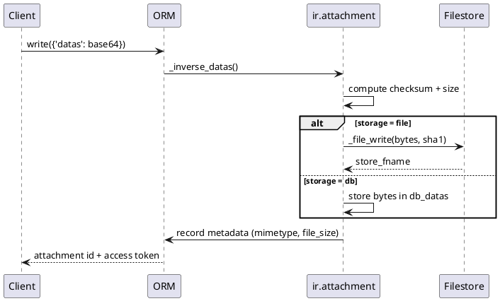

# Attachment Storage & File Services (Odoo 18)

> **Summary:** `ir.attachment` is the canonical repository for binaries and external links. It abstracts on-database blobs, the filestore, and pluggable backends while providing secure download routes, garbage collection, and deduplication across every module.

## Component inventory
| Domain | Implementation | Path | Responsibilities |
|--------|----------------|------|------------------|
| Attachment model | `ir.attachment` | `odoo/addons/base/models/ir_attachment.py` | Persists metadata, stores content, enforces checks, handles GC/migration. |
| Streaming helper | `ir.binary` | `odoo/addons/base/models/ir_binary.py` | Powers `/web/content` & `/web/image` routes via `Stream` objects. |
| Binary controller | `ir.http` overrides | `odoo/addons/base/models/ir_binary.py` + `odoo/http.py` | Validates tokens, builds HTTP responses with caching headers. |
| Filestore helper | `config.filestore` & `_file_*` hooks | `odoo/tools/config.py`, `ir_attachment` | Resolves disk paths, writes hashed files, schedules GC. |
| External backends | cloud storage modules | `addons/cloud_storage*/models/ir_attachment.py` | Override `_file_read/_file_write` for S3/Azure/GCS. |
| Field attachments | `fields.Binary(attachment=True)` | `odoo/fields.py` | Stores field data as linked attachments per record/field. |

## Storage pipeline
1. Create/write on `ir.attachment` (or a binary field with `attachment=True`) feeds the `raw`/`datas` inverse. Content is base64-decoded, checksumed (SHA1), and `_file_write` is invoked.
2. Filestore mode (`ir_attachment.location = 'file'`) scatters files under `<filestore>/<db>/<sha[:2]>/<sha>`; duplicate content reuses the checksum path.
3. Database mode (`'db'`) stores bytes in `db_datas` and leaves `store_fname` empty. Migration helpers (`force_storage`, `_migrate`) let administrators switch modes.
4. Metadata columns (`checksum`, `file_size`, `mimetype`, `index_content`) are recomputed to aid deduplication, previews, and full-text indexing.
5. Downloads and image rendering use `ir.binary._get_stream_from()` / `_get_image_stream_from()`, returning `odoo.http.Stream` instances with correct mimetypes, filenames, and cache ETags.

## Security & access control
- Attachments inherit ACLs/record rules from their `res_model/res_id`. `ir.attachment.check(mode)` enforces that only internal users (or public ones for explicitly `public` attachments) can read/write.
- Signed URLs rely on `access_token`; `ir.binary` validates tokens via `verify_limited_field_access_token` and serves content with limited sudo.
- Field-level groups plus record rules still apply when `attachment=True` binary fields are streamed -`ir.binary` fetches the related attachment with sudo only after checking field permissions.
- Public website/portal downloads require explicit toggling (`public=True`) or controllers issuing their own token.

## Garbage collection & housekeeping
- `_mark_for_gc` writes checklist files under `filestore/checklist/` whenever attachments are removed or rewritten.
- Autovacuum job `_gc_file_store` locks `ir_attachment`, walks the checklist, and deletes orphaned blobs while removing empty directories.
- Checksums detect duplicates before writing; `_same_content` prevents accidental overwrites when separate attachments hash collide.
- The `index_content` column stores text extracted by addons (PDF indexers, mail thread) to power search.

## External & hybrid storage
- The backend can be switched globally with `ir_attachment.location` (`file`, `db`, or custom). Custom backends override `_file_read/_file_write/_file_delete` to interact with S3, Azure, etc., while keeping metadata in PostgreSQL.
- Enterprise cloud modules provide ready-made adapters that respect checksums, naming and GC contracts; consult `addons/cloud_storage_*` for patterns (retry logic, signed URLs, lazy fetch).
- Integrations often set `store_fname` to a pseudo-URI (`azure://container/blob`) to trace remote objects.

## Binary field attachments
- Declaring `fields.Binary(..., attachment=True)` stores values as attachments tied to `(res_model, res_id, res_field)`. This keeps large blobs out of the main table, supports streaming, and allows lazy loading.
- When the field is read, ORM resolves attachments transparently; deletions trigger `_attachment_unlink` cleanup in `BaseModel.unlink`.
- For multi-company records, deletion helpers ensure company-dependent defaults are preserved by cleaning `ir.default` references before removing blobs.

## HTTP delivery semantics
- `/web/content/<id>` and `/web/image/<model>/<id>/<field>` routes use `ir.binary` to stream attachments with proper caching (`ETag`, `Last-Modified`), range support, and optional resizing for images.
- Query string flags (`download=true`, `unique=<checksum>`) control download headers and cache busting.
- `Stream` objects abstract data sources (`data`, `path`, `iterator`) so controllers can serve in-memory bytes, disk files, or external generators while honouring chunked responses.

## Operations & observability
- Monitor filestore size vs database size; `psql` + disk metrics reveal whether attachments remain in-db. `config.filestore(db_name)` locates the root directory.
- Loggers `odoo.addons.base.models.ir_attachment` and `ir_binary` surface GC, collision, and access errors. Enable DEBUG during migrations to track `_file_write` calls.
- Cron `ir.attachment.gc` runs daily; adjust schedule when using large external backends or after bulk import.
- Backup & restore: copy both PostgreSQL dump and matching `filestore/<db>` directory. Missing filestore files will produce empty downloads and log warnings.

## Extension guidelines
- Always supply `mimetype` when creating attachments programmatically to avoid expensive detection.
- Use `raw` for streaming-ready bytes to skip base64 overhead; the ORM auto-fills `datas` from `raw` when needed.
- Wrap privileged reads in `sudo()` sparingly and document why (e.g. to serve customer invoices via portal tokens).
- When building integrations, respect checksum reuse to keep dedup effective; store remote object identifiers in custom metadata fields.

## Related notes
- `[[Odoo 18/Core/Infrastructure/Index.md]]`
- `[[Odoo 18/Core/Infrastructure/ORM.md]]`
- `[[Odoo 18/Core/Infrastructure/Security.md]]`
