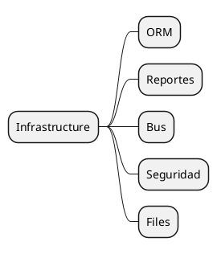

# Core Infrastructure v18

## Components to document
- ORM and meta models -> `[[Odoo 18/Core/Infrastructure/ORM.md]]`
- Reporteria (`report`, `qweb`, PDF) -> `[[Odoo 18/Core/Infrastructure/Reportes.md]]`
- Bus and queues -> `[[Odoo 18/Core/Infrastructure/Bus.md]]`
- Advanced Security -> `[[Odoo 18/Core/Infrastructure/Seguridad.md]]`
- Files and attachments -> `[[Odoo 18/Core/Infrastructure/Files.md]]`

## Actions
- Detail internal APIs and decorators.
- Map with interactions external services.
- Evaluate integrated scalability tools.

