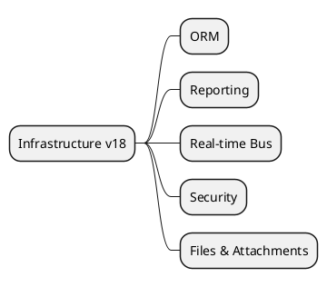

---
tags: [v18, core, infrastructure]
status: in-progress
---
# Core Infrastructure v18

> **Purpose:** track the foundational services that every module relies upon and surface the current documentation depth for each topic.

## Component tracker
- ORM & meta models *(analysis in progress)* -> `[[Odoo 18/Core/Infrastructure/ORM.md]]`
- Reporting stack (QWeb, PDF, assets) *(draft)* -> `[[Odoo 18/Core/Infrastructure/Reports.md]]`
- Real-time bus & queues *(draft ready)* -> `[[Odoo 18/Core/Infrastructure/Bus.md]]`
- Security internals *(draft)* -> `[[Odoo 18/Core/Infrastructure/Security.md]]`
- File storage & attachments *(todo)* -> `[[Odoo 18/Core/Infrastructure/Files.md]]`

## Next actions
- Expand the reporting note with rendering pipeline diagrams and sample QWeb overrides.
- Capture the access-control stack (ACLs, record rules, sudo) in the security note.
- Document binary storage, attachment lifecycle, and external storage hooks in the files note.
- Cross-link module-specific usages (e.g., `mail`, `queue_job`) back into the bus note as those module docs are drafted.
