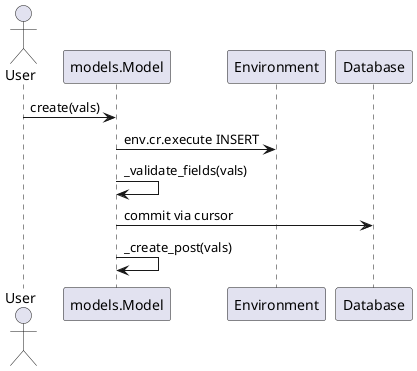

---
tags: [v18, core, infrastructure, orm, analysis]
status: draft
---

# ORM Internals (Odoo 18)

> **Summary:** The object-relational mapping layer in Odoo powers every model (`models.Model`). This note expands on architecture, decorators, environment, caching, and best practices for overrides.

## 1. Core components

| Component | File | Notes |
|-----------|------|-------|
| `BaseModel` / `Model` | `odoo/models.py` | Base classes implementing CRUD, caching, environment handling. |
| Field descriptors | `odoo/fields.py` | Field classes handle conversion, prefetch, compute, inverse. |
| API helpers | `odoo/api.py` | Decorators (`@api.model`, `@api.depends`, etc.) manipulate method signatures/environment. |
| Environment | `odoo/api.py` (`Environment`) | Wraps cursor, user, context, cache. |
| Prefetch | `odoo/models.py:Prefetch` | Batches reads per model/field to minimize queries. |

## 2. Environment & recordsets
- `env`: always attached to recordsets. Contains `env.cr`, `env.uid`, `env.context`, `env.company`, `env.companies`.
- Recordsets are lazy: operations like `mapped`, `sorted`, `filtered` evaluate on-demand.
- Environments obey company context; switching company invalidates caches (`with_company`, `with_user`).

## 3. Decorators

| Decorator | Purpose |
|-----------|---------|
| `@api.model` | Receives `self` as empty recordset, returns python objects. |
| `@api.depends` | Tracks field dependencies for compute methods. |
| `@api.constrains` | Enforces validations post-write/create. |
| `@api.onchange` | UI-only compute (no persistence). |
| `@api.autovacuum` | Scheduled maintenance routines. |
| `@api.returns` | Controls RPC serialization type. |

## 4. CRUD flow

- `create()`: checks ACLs, applies defaults, creates record, calls compute/inverses, posts `message_post`. Use `sudo()` carefully to bypass restrictions.
- `write()`: updates fields, triggers dependent computes, invalidates caches with `invalidate_recordset`.
- `unlink()`: enforces ondelete rules, clears caches.

## 5. Prefetch & caching
- Prefetch groups record ids by model/field; reduces queries when iterating.
- Cache stored in `env.cache`. Invalidate with `invalidate_recordset`, `env.cache.invalidate()`.
- Use `with_context(prefetch_fields=False)` for heavy loops to control prefetching. Avoid manual SQL unless needed—always invalidate caches when you do.

## 6. Security & multi-company
- Access rules: `env['ir.model.access'].check()` and `_check_access_rule` enforce ACLs/record rules.
- Multi-company: `env.companies` set from user context; record rules often filter on `company_id`. Use `with_company` for contextual operations instead of `sudo()`.
- Auditing: `sudo()` logs `sudo_user_id`; minimize usage to keep audit trail clear.

## 7. Best practices
- Always call `super()` in overridden CRUD methods.
- Ensure `@api.depends` covers every field read; missing dependencies cause stale values.
- Keep computed fields idempotent and side-effect free.
- For performance-sensitive loops, use `read_group` or SQL with `env.cr` cautiously.
- Validate data in `_check_company_domain` or `@api.constrains` to enforce multi-company rules.

## 8. To-do
- [ ] Document detailed cache invalidation patterns per field type.
- [ ] Add example showing record rules evaluation in custom code.
- [ ] Compare with v19 ORM changes once diff completed; update `[[Comparisons/Core ORM]]`.

## Navigation
- **Parent:** `[[Odoo 18/Core/Infrastructure/Index]]`
- **Related:** `[[Odoo 18/Core/Architecture.md]]`, `[[Odoo 18/Core/Master Data/res_partner.md]]`, `[[Comparisons/Core ORM]]`
