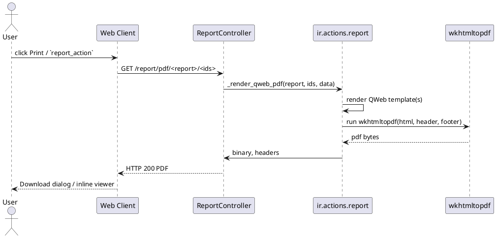

# QWeb Reports & Output Rendering (Odoo 18)

> **Summary:** Server-side reports turn QWeb templates into HTML, PDF, or plain text responses. `ir.actions.report` orchestrates the rendering pipeline, delegates layouting to `ir.ui.view`, and relies on wkhtmltopdf plus optional attachments to deliver consistent output to every client (web, portal, API).

## Component inventory
| Domain | Implementation | Path | Responsibilities |
|--------|----------------|------|------------------|
| Report action model | `ir.actions.report` | `odoo/addons/base/models/ir_actions_report.py` | Stores report metadata, template references, paper formats, attachment rules, and exposes `_render_*` helpers. |
| Paper formats | `report.paperformat` | `odoo/addons/base/models/report_paperformat.py` | Defines paper size, margins, DPI, headers/footers, and company defaults. |
| Controller | `ReportController` | `addons/web/controllers/report.py` | Routes `/report/<fmt>/<report>` requests, marshals context/options, and returns HTML/PDF/Text payloads. |
| Client action | `ReportAction`, `downloadReport` | `addons/web/static/src/webclient/actions/reports/*.js` | Displays HTML reports in an iframe, launches PDF downloads, handles wkhtmltopdf warnings. |
| Templates | QWeb views (`ir.ui.view`) | e.g. `addons/web/views/report_templates.xml` | Provide base layouts (`web.external_layout`/`internal_layout`), helper macros, and module-specific bodies. |
| Binary helper | `report.download` & `/report/barcode` | `addons/web/controllers/report.py` | Provides download indirection and barcode image generation. |
| Alternate engines | module-specific classes (e.g. `report_xlsx`) | community/enterprise addons | Enable non-QWeb outputs (XLSX, CSV) via custom `report_type`. |

## Data model & configuration
- `ir.actions.report` records bind a model (`model`), a template (`report_name`), and an output type (`report_type`: `qweb-html`, `qweb-pdf`, `qweb-text`).
- Paper format resolution cascades: action `paperformat_id` -> company `res.company.paperformat_id` -> built-in defaults (`base.paperformat_*`). The chosen format controls margins, dpi, header/footer spacing, and orientation.
- Attachment controls:
  - `attachment` (expression) and `attachment_use` decide whether generated PDFs are cached per record.
  - `print_report_name` lets you compute download filenames with Python expressions using `object` and `time` helpers.
- Security hooks: `groups_id` restricts report visibility; reports respect the caller's record rules unless the action is executed with `sudo`.
- Wizards pass options through `action.data`; the controller JSON-decodes `options` and merges contexts before invoking `_render_*`.

## Rendering pipeline
1. A button or server call triggers `report_action(model, docids, data)` which returns a client action describing the report.
2. The web client resolves the action in `action_service` and either:
   - downloads directly (PDF/Text) via `downloadReport`, or
   - opens the HTML client action (`ReportAction`) with an iframe pointed at `/report/html/...`.
3. `ReportController` validates session/auth, resolves the report by `report_name`, and calls `_render_qweb_html/pdf/text`.
4. `_render_template` evaluates the QWeb template with report helpers (company, user, timezone, `time`, `formatLang`).
5. For PDFs, `_render_qweb_pdf_prepare_streams` applies headers/footers, splits multi-record outputs, and calls `_run_wkhtmltopdf`.
6. `_post_pdf` persists attachments or merges with existing ones, then returns binary data to the controller.
7. The controller sets HTTP headers (`Content-Type`, `Content-Length`, `Content-Disposition`) and streams the response back to the browser.

## Template layering & helpers
- Base layouts live in `web.report_layout` modules (`web.external_layout`, `web.internal_layout`, `web.external_layout_footer`). Reports typically `t-call` these wrappers and inject their body via `<t t-set="doc_ids"/>` etc.
- `report.report_template` introduces helper macros (addresses, signatures, table styles) that modules can inherit or replace.
- QWeb extensions for reports disable website branding (`inherit_branding=False`) and expose extra helpers:
  - `context_timestamp` respects user timezone.
  - `user`, `res_company`, and `web_base_url` are available in the rendering context.
  - Barcode helpers (`report/barcode`) and `formatLang` ease data formatting.
- Layout inheritance allows hierarchical documentation: link to sub-notes when splitting complex reports (e.g., `[[Odoo 18/Core/Framework/Web.md#L??]]` for QWeb syntax deep dives).

## wkhtmltopdf & binary generation
- Odoo checks wkhtmltopdf presence at startup. `wkhtmltopdf_state` can be `install`, `upgrade`, `workers`, `broken`, or `ok`; the client displays warnings and falls back to HTML when required.
- `wkhtmltopdf_dpi_zoom_ratio` tunes the zoom factor for accurate DPI alignment.
- Large tables trigger `_split_table` to avoid exponential wkhtmltopdf rendering times by chunking rows.
- Multipage outputs can be split per record when templates mark article nodes with `data-oe-model` and `data-oe-id`. Failing to do so prevents attachment caching (guarded by a `UserError`).
- When attachments are enabled, `_render_qweb_pdf` stores a copy per record and short-circuits later calls using `_retrieve_attachment`. This preserves signed invoices and prevents recomputation.

## HTML, text, and interactive flows
- HTML converter returns raw rendered QWeb; the client action injects it in an iframe and augments links via `useEnrichWithActionLinks` so related records open inside Odoo.
- Text converter (`qweb-text`) is used for plain exports. It still runs through QWeb but yields simple strings.
- Controllers expose `/report/barcode` for embedded images and `/report/download` to queue asynchronous downloads.
- Portal users leverage the same endpoints; access rights are validated by `report_sudo._check_access_rights` and record rules.

## Alternate engines & community patterns
- Non-QWeb reports register custom `report_type` handlers by overriding `_render` (e.g., `report_xlsx` adds XLSX generation through `xlsxwriter`).
- Enterprise PDF signing hooks into `_post_pdf` to append certificates.
- Modules can provide pure Python rendering by creating a model subclass with `_get_rendering_context` and returning binary/text streams directly.

## Operations, debugging, observability
- Enable `--dev=reports` to auto-reload report assets and expose debug info within the iframe.
- Use `?context={'binary_report': True}` to bypass HTML fallback when testing wkhtmltopdf.
- Logs: `odoo.addons.base.models.ir_actions_report` traces wkhtmltopdf problems; look for messages such as "Will use the Wkhtmltopdf binary" (startup), "Odoo is unable to merge the generated PDFs" (attachment split errors), or "You need Wkhtmltopdf" when the binary is missing.
- Common issues: missing fonts, misconfigured paper sizes, or wkhtmltopdf lacking the required version (>= 0.12.5 recommended for headers/footers and flex). Provide these remedies in local ops runbooks.

## Extension patterns
- Wrap report actions with Python helpers (`record.action_print_*`) to centralize context building.
- Override `_get_report_values` to supply template variables while keeping super call semantics for compatibility.
- Chain `t-call` to modularize complex layouts (header, table, totals) and link each fragment to dedicated notes for maintainability.
- Use `report.paperformat` per company or per action to deliver localized stationery (e.g., US Letter vs A4, specific margin requirements).

## Related notes
- `[[Odoo 18/Core/Infrastructure/Index.md]]`
- `[[Odoo 18/Core/Framework/Web.md]]`
- `[[Odoo 18/Examples/Service Subscription Example.md]]` (extend with invoicing report walkthrough later)
