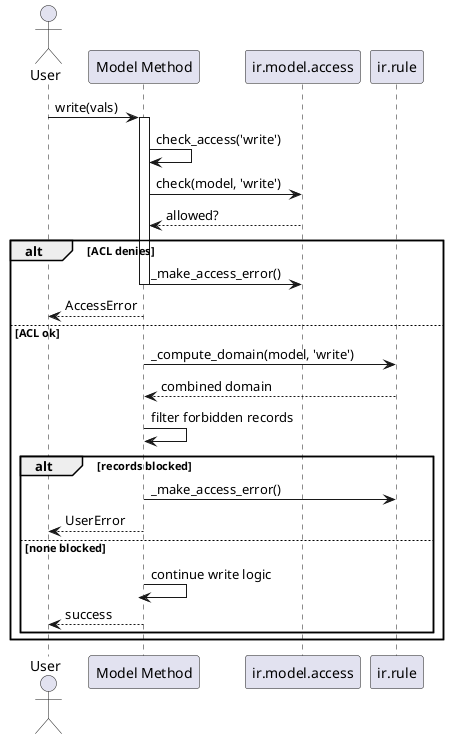

# Access Control & Security Pipeline (Odoo 18)

> **Summary:** Every ORM operation in Odoo runs through a layered permission stack: model ACLs (`ir.model.access`), record rules (`ir.rule`), field-level restrictions, and multi-company filters. This note maps how those layers interact in 18.0, where the unified `check_access()` flow replaces older helpers and centralises error reporting.

## Component inventory
| Layer | Implementation | Path | Purpose |
|-------|----------------|------|---------|
| ACL registry | `ir.model.access` | `odoo/addons/base/models/ir_model.py` | Stores CRUD permissions per model/group, exposes `_get_allowed_models()` and `_make_access_error()`. |
| Record rules | `ir.rule` | `odoo/addons/base/models/ir_rule.py` | Holds domain-based rules with group filters and computes combined domains through `_compute_domain()`. |
| ORM enforcement | `BaseModel.check_access` / `_check_access` | `odoo/models.py` | Applies ACLs then rule domains for each operation, returning forbidden records and errors. |
| SQL guard | `_apply_ir_rules` | `odoo/models.py` | Injects rule domains into query objects so searches/read_group respect the same constraints. |
| User profile | `res.users` | `odoo/addons/base/models/res_users.py` | Provides group membership, allowed companies, and helpers like `_get_group_ids()` and `_get_company_ids()`. |
| Field security | `fields.Field(groups=...)` | `odoo/fields.py` & view definitions | Limits visibility/editability of individual fields by group. |
| Superuser shortcuts | `BaseModel.sudo`, `env.su`, `with_user` | `odoo/models.py` | Temporarily bypass or swap security context while keeping audit info. |

## Permission evaluation flow
1. Call sites (UI buttons, RPC, Python code) invoke `recordset.check_access(operation)` or the convenience CRUD methods (`create`, `write`, `unlink`, `read`).
2. `_check_access` checks ACLs first via `ir.model.access.check(...)`. If no matching ACL grants the permission, Odoo raises an `AccessError` listing groups that do have access.
3. For persisted records, the method retrieves the record-rule domain from `ir.rule._compute_domain(model, operation)` and filters the recordset. Any leftover records trigger a `UserError` describing the violating rule.
4. Queries generated by `search` / `read_group` call `_apply_ir_rules`, which appends the same domain to the SQL builder so forbidden rows never reach Python.
5. Field-level restrictions are enforced when fields are fetched/assigned: `fields.Field.groups` hides columns in views and raises if code tries to touch them without the proper group.

## ACL mechanics
- ACL rows may target everyone (`group_id` empty) or specific groups. Missing ACLs default to denial; module data typically seeds one read-only ACL for public models.
- ACL results are cached per user via `_get_allowed_models()`. Mutating ACLs calls `call_cache_clearing_methods()` to invalidate caches and registry state.
- Access errors enumerate groups with the missing permission (helpful for onboarding administrators) and log the denial (`Access Denied by ACLs for operation...`).
- New in 18.0: `check_access_rights` is deprecated in favour of `check_access` / `has_access`, but legacy callers still benefit from the same pipeline.

## Record rules & domains
- Rules split into **global** (no groups) and **group-scoped** lists. Global domains are AND-ed; group domains are OR-ed within the groups the user belongs to, and the result is AND-ed with globals.
- `_compute_domain` also folds inherited models: parent `_inherits` rules are injected as `[('parent_id', 'any', parent_domain)]` clauses.
- Domains execute in a sanitized evaluation context: `user` (with empty context), `time`, `company_ids`, and `company_id`. Expensive computations should be avoided; the method is cached with keys like `allowed_company_ids`.
- `_get_failing` helps debugging by returning the exact rules that reject a given record set.
- SQL-level enforcement ensures even aggregated queries (`read_group`, `search_count`) respect the same filters.

## Field- and view-level protection
- Any field declared with `groups="base.group_user"` is automatically hidden from other users and raises on access attempts. Views mirror the same mechanism via `<field groups="...">` or `<xpath groups="...">`.
- Mail and portal modules often pair field groups with dynamic record rules to expose safe subsets of data (e.g., chatter followers can read limited fields only).

## Multi-company context
- The environment carries `allowed_company_ids` (selected in the UI) and `company_id` (current company). Record rules commonly restrict results with `('company_id', 'in', company_ids)` conditions referencing these values.
- Methods `with_company(company)` or `env['res.company']._get_main_company()` allow explicit switching. If a record belongs to a disallowed company, the rule filter strips it even if ACLs grant access.
- Many2one fields flagged as company-dependent also trigger clean-up during deletions to prevent cross-company defaults from leaking.

## Sudo, impersonation, and testing
- `record.sudo()` flips `env.su` to true, bypassing ACLs and rules but retaining the original UID for auditing inside `self.env.uid`. Prefer `with_user(target_user)` to simulate real access without superuser powers.
- Inside server actions or cron jobs, always document why sudo is necessary and scope it narrowly (`with_context(active_test=False)` remains separate).
- Unit tests should assert behaviour with both regular users and sudoed environments to ensure no unwanted bypass occurs.

## Troubleshooting & instrumentation
- Enable `--log-handler=odoo.addons.base.models.ir_model.access:DEBUG` to inspect ACL decisions; use the similar logger for `ir.rule` to see domains.
- Temporarily run the server with `--dev=security` (custom dev flag) or extend tests in `odoo/addons/test_access_rights` to reproduce edge cases.
- Use `env['ir.rule']._get_failing(records, 'write')` to list problematic rules during debugging sessions.

## Extension guidelines
- Package new models with at least one ACL (read-only + group-specific) to avoid silent denials.
- Prefer record rules over hard-coded domain filters in Python; they keep security centralised and are enforced on search/read automatically.
- For performance, minimise the number of overlapping rules and keep domains index-friendly.
- Document every sudo call in code comments and consider dedicated helper methods that encapsulate privileged actions.

## Related notes
- `[[Odoo 18/Core/Infrastructure]]`
- `[[Odoo 18/Core/Infrastructure/ORM.md]]`
- `[[Odoo 18/Core/Framework/Web.md]]`

## Navigation
- **Parent:** [[Odoo 18/Core/Infrastructure/Infrastructure]]
