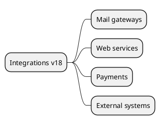

# Core Integrations v18

## Base connectors
- External messaging (SMTP/IMAP) -> `[[Odoo 18/Core/Integrations/Mail Gateways.md]]`
- Web services (XML-RPC/JSON-RPC/REST) -> `[[Odoo 18/Core/Integrations/Web Services.md]]`
- Payments -> `[[Odoo 18/Core/Integrations/Payments.md]]`
- Third-party systems -> `[[Odoo 18/Core/Integrations/External Systems.md]]`

## Goals
- Document available APIs and scenarios.
- Identify credentials and secure storage.
- Register recurring extension points.

## Navigation
- **Parent**: `[[Odoo 18/Core/Index]]`
- **Children**:
  - `[[Odoo 18/Core/Integrations/Mail Gateways.md]]`
  - `[[Odoo 18/Core/Integrations/Web Services.md]]`
  - `[[Odoo 18/Core/Integrations/Payments.md]]`
  - `[[Odoo 18/Core/Integrations/External Systems.md]]`

## Children
- [[Odoo 18/Core/Integrations/External Systems]]
- [[Odoo 18/Core/Integrations/Mail Gateways]]
- [[Odoo 18/Core/Integrations/Payments]]
- [[Odoo 18/Core/Integrations/Web Services]]