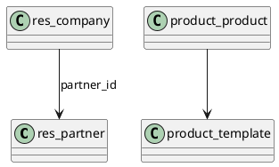

# Core Master Data v18

## Central entities
- `[[Odoo 18/Core/Master Data/res_partner.md]]`
- `[[Odoo 18/Core/Master Data/product_template.md]]`
- `[[Odoo 18/Core/Master Data/product_product.md]]`
- `[[Odoo 18/Core/Master Data/uom_uom.md]]`
- `[[Odoo 18/Core/Master Data/res_company.md]]`
- `[[Odoo 18/Core/Master Data/res_users.md]]`
- `[[Odoo 18/Core/Processes/Accounting/account_move.md]]` (entry consumer)

## Tasks
- Model relationships between partners, companies and users.
- Document common inheritances and mixins (`mail.thread`, `mail.activity.mixin`).
- Analyze multi-company and multi-currency policies.

## Navigation
- **Parent**: `[[Odoo 18/Core]]`
- **Children**:
  - `[[Odoo 18/Core/Master Data/res_partner.md]]`
  - `[[Odoo 18/Core/Master Data/product_template.md]]`
  - `[[Odoo 18/Core/Master Data/product_product.md]]`
  - `[[Odoo 18/Core/Master Data/uom_uom.md]]`
  - `[[Odoo 18/Core/Master Data/res_company.md]]`

## Children
- [[Odoo 18/Core/Master Data/product_product]]
- [[Odoo 18/Core/Master Data/product_template]]
- [[Odoo 18/Core/Master Data/res_company]]
- [[Odoo 18/Core/Master Data/res_partner]]
- [[Odoo 18/Core/Master Data/res_partner_category]]
- [[Odoo 18/Core/Master Data/res_users]]
- [[Odoo 18/Core/Master Data/uom_uom]]