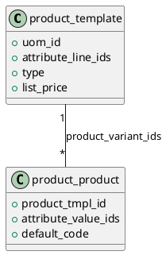

# `product.template` (Odoo 18)

> **Summary:** The template encapsulates the commercial definition of a product. It drives variant generation, pricing, stocking policies, and the hooks that downstream apps (Sales, Purchase, MRP, POS) use to interpret catalogue data.

## Model snapshot
- **Python class:** `ProductTemplate` in `odoo/addons/product/models/product_template.py`
- **Database table:** `product_template`
- **Key mixins:**
  - `mail.thread`, `mail.activity.mixin` for chatter and activities.
  - `image.mixin` to store media in `image_*` fields (see `[[Odoo 18/Core/Infrastructure/Files.md]]`).
  - `utm.mixin` to track marketing source.
- **Variant relation:** one template maps to many `product.product` records through `product_variant_ids`; variant count flows to `product_variant_id` (single variant optimisation).
- **Dependency graph:** valuations and routes bridge to `stock.move`, `stock.rule`, and accounting configuration via `property_cost_method`, `property_valuation`, `property_account_income_id`.

## Lifecycle & variant logic
1. Template is created with attribute lines (`attribute_line_ids`).
2. Combinatorial engine (fields `attribute_line_ids`, `value_ids`) generates variants through `_create_variant_ids`.
3. Archived variants are reactivated automatically if attribute sets match; template keeps `active` flag orchestrating both template and variant visibility.
4. Unit of measure (`uom_id`, `uom_po_id`) defines sales vs purchase conversion; both link to `[[Odoo 18/Core/Master Data/uom_uom.md]]`.

## Pricing & fiscal controls
- **Sales price:** `list_price` (a.k.a. Public price) feeds pricelists; multi-currency uses `[[Odoo 18/Core/Infrastructure/ORM.md]]` currency fields.
- **Costing:** `standard_price` stores current cost, updated by inventory adjustments or valuation layers.
- **Accounts:** `property_account_income_id`, `property_account_expense_id` override journal defaults for `[[account.move]]` lines.
- **Taxes:** default taxes per template propagate to orders (`taxes_id`, `supplier_taxes_id`).

## Logistics integration
- **Type (`type`):** stockable, consumable, service; influences reservation and procurement.
- **Routes & rules:** `route_ids` and `property_stock_*` fields map into pull/push rules executed by `stock.rule`.
- **Packaging:** `packaging_ids` connect to shipping dimensions and barcode packaging flows.
- **Reordering:** buffer controls (`orderpoint_ids`) feed MTO/MTS flows within `[[Odoo 18/Core/Processes/Inventory/Index.md]]`.

## Related notes
- Variants: `[[Odoo 18/Core/Master Data/product_product.md]]`
- Partners & vendors: `[[Odoo 18/Core/Master Data/res_partner.md]]`
- Accounting flows: `[[Odoo 18/Core/Processes/Accounting/account_move.md]]` (to be created)
- Infrastructure: `[[Odoo 18/Core/Infrastructure/Files.md]]`, `[[Odoo 18/Core/Infrastructure/Reports.md]]`

## Navigation
- **Parent:** [[Odoo 18/Core/Master Data/Index]]
