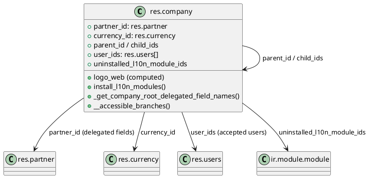
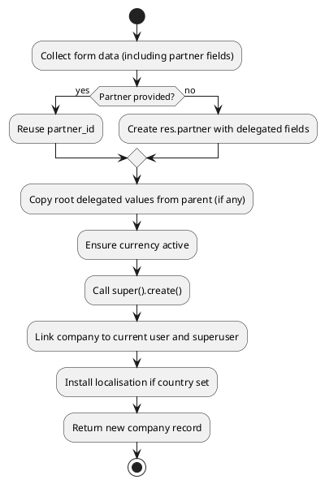

# `res.company` (Odoo 18)

> **Summary:** Represents a legal entity operating inside the multi-company environment. It ties together commercial identity (partner record), financial configuration (currency, papers, report layout), localisation modules, and access control for users.

## Model definition
- **Python class:** `Company` in `odoo/addons/base/models/res_company.py`
- **Inheritance:** extends `models.Model` with mixins `format.address.mixin`, `format.vat.label.mixin`; enables hierarchical parent/child structure via `_parent_store`.
- **Database table:** `res_company`.
- **Core delegation:** Many fields (`name`, address, VAT, contact info, logo) are delegated to `partner_id`. Company behaves as a façade over `res.partner`.

## Field clusters of interest

| Category | Fields | Notes |
|----------|--------|-------|
| **Identity & branding** | `name`, `logo`, `logo_web`, `uses_default_logo`, `report_header`, `report_footer`, `company_details`, `paperformat_id`, `external_report_layout_id`, `font`, `primary_color`, `secondary_color`, `layout_background`, `layout_background_image` | Provide the legal name, visual identity, and reporting templates. Most values come from `partner_id` or are propagated to branches. |
| **Hierarchy** | `parent_id`, `child_ids`, `parent_ids`, `root_id`, `parent_path`, `sequence`, `active` | Manage multi-company tree and ordering in company switcher. `_parent_store` indexes the hierarchy for fast searches. |
| **Delegated contact data** | `street`, `city`, `zip`, `state_id`, `country_id`, `email`, `phone`, `mobile`, `website`, `vat`, `company_registry`, `bank_ids` | Computed/inversed from `partner_id` (`_compute_address`, `_inverse_*` methods). Editing the company updates the underlying partner. |
| **Financial control** | `currency_id`, `fiscal_country_codes` (in l10n), `uninstalled_l10n_module_ids` | Currency is a root-delegated field; subsidiaries must match their root via `_get_company_root_delegated_field_names`. Localisation modules are suggested based on `country_id`. |
| **Users & security** | `user_ids` | Multi-company access list; `create()` links the new company to current user and superuser to keep access rights consistent. |
| **Color / UI** | `color`, `layout_background` | Influences kanban badges and document styling; synchronized across branches. |

## Behaviour & methods

| Method | Source | Description |
|--------|--------|-------------|
| `copy()` | res_company.py:17 | Forbids duplicating a company to avoid inconsistent partner delegation. |
| `_get_logo()` | res_company.py:20 | Loads default logo from filesystem for new companies. |
| `_get_company_root_delegated_field_names()` | res_company.py:53 | Lists fields that must match the root company (currently `currency_id`). |
| `_compute_address()` / `_inverse_*` | res_company.py:61–94 | Keep delegated address fields synchronised with `partner_id`. |
| `_compute_parent_ids()` | res_company.py:67 | Populates `parent_ids`/`root_id` using `parent_path`. |
| `_compute_logo_web()` / `_compute_uses_default_logo()` | res_company.py:99–110 | Generate resized logos and detect default logo usage for UI optimisations. |
| `_compute_uninstalled_l10n_module_ids()` | res_company.py:204 | Suggest localisation modules based on country’s auto-install modules. |
| `install_l10n_modules()` | res_company.py:227 | Installs suggested localisation modules when company has a country set and registry is ready. |
| `create()` | res_company.py:238 | Creates missing partner records, copies delegated fields from parent, links currency, adds company to current user & SUPERUSER, ensures currency active, and triggers localisation install. |
| `write()` | res_company.py:312 | Clears caches when key fields change, forbids altering `parent_id`, ensures currency active, cascades updates to branches, installs localisations, and deactivates branches when archiving. |
| `_check_active()` | res_company.py:339 | Prevents archiving a company that still has active users. |
| `_check_root_delegated_fields()` | res_company.py:416 | Enforces that branch values for delegated fields equal the root values. |
| `__accessible_branches()` / `_accessible_branches()` | res_company.py:430–454 | Compute branch IDs the current user can access (cached via `ormcache`). |
| `_all_branches_selected()` | res_company.py:456 | Utility to verify context includes entire branch set. |
| `action_all_company_branches()` | res_company.py:470 | Returns window action listing the company’s branches. |
| `_get_public_user()` | res_company.py:480 | Ensures each company has a dedicated “public” portal user; copies base user if missing. |

## Company creation flow

## Cross-module relationships
- **Accounting:** `currency_id`, fiscal localisation, and `paperformat_id` drive financial reporting defaults. Many accounting modules read company properties (e.g., default journals).
- **Sales/Inventory/Projects:** use company hierarchy to filter records and enforce multi-company isolation.
- **Portal / Website:** `_get_public_user()` ensures each company exposes a public user for website/portal access.
- **Localization packages:** `install_l10n_modules()` auto-installs country-specific modules; additional modules can be triggered via `button_install` (see `base_setup` views).

## Checklist & next tasks (Issue #2)
- [ ] Expand on localisation/hooks interplay with `ir.config_parameter` and accounting modules.
- [ ] Document company-specific properties stored in `ir.property` (e.g., account default values).
- [ ] Add examples of security rule impacts (record rules restricting cross-company access).

## Navigation
- **Parent:** `[[Odoo 18/Core/Master Data/Index]]`
- **Related:** `[[Odoo 18/Core/Master Data/res_partner.md]]`, `[[Odoo 18/Core/Master Data/res_users.md]]`, `[[Odoo 18/Core/Architecture.md]]`
- **Issue:** #2 `Docs: Odoo 18 - res.company`
