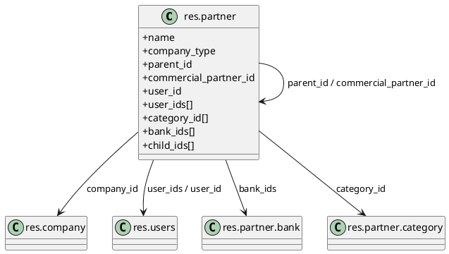
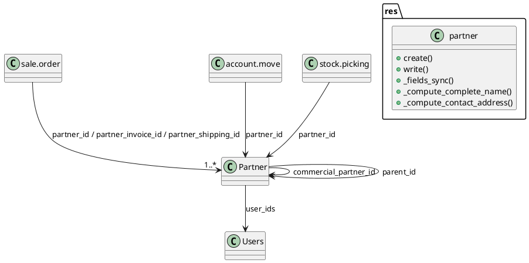

# `res.partner` (Odoo 18)

> **Summary:** Central contact model that unifies people, companies, suppliers, customers, and collaboration accounts. It sits at the heart of CRM, Sales, Purchasing, Accounting, and HR. Almost every business workflow in Odoo references this record through many-to-one relations.

## Model definition
- **Python class:** `Partner` in `odoo/addons/base/models/res_partner.py`
- **Inherits / mixins:**
  - `models.Model`
  - `format.address.mixin` - dynamic address formatting per country.
  - `format.vat.label.mixin` - country-specific VAT labels.
  - Messaging stack: `mail.thread`, `mail.activity.mixin`, `mail.alias.mixin`.
  - Avatar pipeline from `res.partner.avatar.mixin`.
- **Database table:** `res_partner`.
- **Key relations:**
  - Self-recursive `parent_id` (company tree) and `commercial_partner_id`.
  - `user_ids` -> `[[Odoo 18/Core/Master Data/res_users.md]]` (employees/portal users).
  - `company_id` + `allowed_company_ids` -> `[[Odoo 18/Core/Master Data/res_company.md]]`.
  - `bank_ids` -> `res.partner.bank` and `category_id` -> `[[Odoo 18/Core/Master Data/res_partner_category.md]]` *(to be detailed).* 

## Field clusters of interest
- **Identity & classification**: `name`, `company_type`, `is_company`, `display_name`, `commercial_company_name`, `type`.
- **Commercial hierarchy**: `parent_id`, `child_ids`, `commercial_partner_id`, `commercial_company_name`.
- **Communication**: `email`, `phone`, `mobile`, `website`, `employee`, `function`.
- **Geographic / localisation**: address fields from `format.address.mixin`, plus `tz`, `lang`, `active_lang_count`.
- **Sales & accounting hooks**: `user_id`, `team_id`, `property_payment_term_id`, warning fields shared with Sales/Purchase/Stock.
- **Collaboration**: `user_ids` (portal vs internal users), `calendar_filter`, `message_partner_ids`.

## Computed fields & helpers

| Field | Method | Source | Summary |
|-------|--------|--------|---------|
| `complete_name` | `_compute_complete_name` | `res_partner.py:379` | Builds display name with company prefix and type fallback. |
| `contact_address` | `_compute_contact_address` | `res_partner.py:440` | Formats address using country-specific templates. |
| `partner_share` | `_compute_partner_share` | `res_partner.py:401` | Detects whether linked users are shared/portal ones. |
| `commercial_partner_id` | `_compute_commercial_partner` | `res_partner.py:449` | Resolves the top-level commercial entity used by accounting. |
| `user_id` | `_compute_user_id` | `res_partner.py:395` | Inherits salesperson from parent companies when needed. |
| `active_lang_count` | `_compute_active_lang_count` | `res_partner.py:413` | Exposes installed language counts for UX hints. |
| `tz_offset` | `_compute_tz_offset` | `res_partner.py:420` | Provides GMT offset for scheduling widgets. |

## Critical methods and behaviour

| Method | Location | Notes & relationships |
|--------|----------|-----------------------|
| `_get_complete_name()` | `res_partner.py:356` | Helper for compute and search display; merges parent company and contact type. |
| `_commercial_fields()` | `res_partner.py:637` | Lists fields considered "commercial"; drives `_fields_sync` and commercial propagation. |
| `_fields_sync(values)` | `res_partner.py:686` | Propagates commercial fields between related partners; invoked by `create` and `write`. |
| `create(vals_list)` | `res_partner.py:798` | Normalises payload, calls `_fields_sync`, handles notification emails and default banks. |
| `write(vals)` | `res_partner.py:742` | Maintains commercial synchronisation, validates company type switches, pings bus for portal updates. |
| `_get_street_split()` | `res_partner.py:320` | Normalises street data using `tools.street_split`, enabling consistent document layout. |
| `_compute_partner_share()` | `res_partner.py:401` | Distinguishes real employees from shared portal users; key for messaging ACLs. |
| `message_get_suggested_recipients()` | lower in file | Extends mail mixin logic so user-to-partner relations appear in UI suggestions. |

### Cross-module impacts
- **Sales & CRM:** warnings, salesperson inheritance, and lead/opportunity ownership depend on `commercial_partner_id`.
- **Accounting:** payment terms, fiscal positions, and invoicing addresses use the commercial hierarchy.
- **Inventory / Logistics:** delivery contacts (`type='delivery'`) populate stock pickings and carrier connectors.
- **Portal / Website:** `partner_share`, `user_ids`, and avatar mixin govern website account experiences.

## Views and UI definitions
- Primary form and tree views: `odoo/addons/base/views/res_partner_views.xml`.
- Many modules (Sales, Helpdesk, HR) extend the form through `xpath` inheritance; document those overrides in their module notes.

## Suggested diagrams

## Related notes
- Infrastructure: [[Odoo 18/Core/Infrastructure/Security.md]], [[Odoo 18/Core/Infrastructure/Files.md]], [[Odoo 18/Core/Infrastructure/ORM.md]]
- Processes: [[Odoo 18/Core/Processes/Sales]], [[Odoo 18/Core/Processes/Accounting]]
- Variant data: [[Odoo 18/Core/Master Data/product_template.md]], [[Odoo 18/Core/Master Data/product_product.md]]

## Navigation
- **Parent:** [[Odoo 18/Core/Master Data/Master Data]]
## To-do for full coverage
- Document each warning field (`sale_warn`, `purchase_warn`, etc.) and reference the modules that consume them.
- Create dedicated notes for `res.partner.bank` and other partner-related models.
- Map the XML view inheritance chain (form view, portal profile, website signup) with diagrams.
