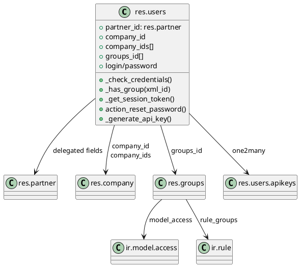
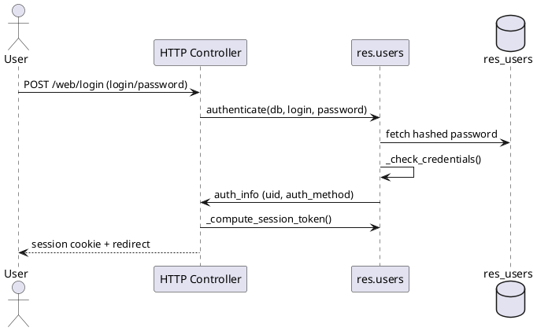

# `res.users` (Odoo 18)

> **Summary:** Represents an interactive or technical user. It inherits contact information from `res.partner`, manages company access, groups/permissions, authentication credentials, and API keys. The model orchestrates login flows, password hashing, session tokens, and user-specific settings.

## Model definition
- **Python class:** `Users` in `odoo/addons/base/models/res_users.py`.
- **Inheritance:** `_inherits = {'res.partner': 'partner_id'}` – most identity/contact fields delegate to the partner record.
- **Auxiliary classes:** `Groups`, `UsersImplied`, `UsersView`, and API key transient models are defined in the same file to support group logic and wizards.
- **Database table:** `res_users` (+ `res_groups`, `res_users_log`, `res_users_apikeys`, ...).

## Field clusters

| Cluster | Fields | Notes |
|---------|--------|-------|
| **Identity** | `partner_id`, `name`, `email`, `active`, `image_*`, `signature` | Inherited from `res.partner`; user editing of name/email writes to partner. |
| **Login credentials** | `login`, `password` (compute/inverse), `new_password` (transient), `_crypt_context` hashing | Password stored as hash; `_set_password` updates via passlib context (default `pbkdf2_sha512`). |
| **Companies** | `company_id`, `company_ids`, `companies_count` | Multi-company support: `company_id` default environment company; `company_ids` is M2M controlling accessible companies. |
| **Groups & security** | `groups_id`, computed pseudo-fields (`in_group_x`, `sel_groups_*`), `share`, `groups_count`, `rules_count`, `accesses_count` | Groups drive ACLs and record rules. Share users are portal/external accounts. Group pseudo-fields populate settings forms dynamically (see helper functions `name_boolean_group`, `is_reified_group`, etc.). |
| **Activity & logging** | `log_ids`, `login_date`, `res_users_log` | Records login times; `_gc_user_logs` autopruner removes stale log entries. |
| **Session & device management** | `device_ids`, session tokens, `_compute_session_token` | Used for web sessions, trusted devices, and bus presence. |
| **API keys** | `res.users.apikeys` models, `_generate`, `_check_expiration_date`, wizards `res.users.apikeys.description/show` | Provide scoped API keys with optional expiration, gated behind `check_identity`. |
| **Preferences** | `lang`, `tz`, `tz_offset`, `res_users_settings_ids`, `action_id` | `action_id` sets default home action, stored per user. |

## Authentication pipeline

1. **Credential check** via `_check_credentials` (`res_users.py:112`): verifies password hash; triggers session token refresh upon rehash.
2. **External methods**: `_auth_method_*` methods (password, oauth, ldap, etc.) plug into `authenticate`.
3. **Identity check for sensitive actions** – `@check_identity` decorator ensures re-auth within 10 minutes for operations like API key generation or resetting security-sensitive fields.
4. **Password flows**:
   - `change_password`, `set_password`, `action_reset_password`: manage resets, send emails, enforce policies (`_check_password_rule`, `_validate_passphrase`).
   - Autovacuum ensures plaintext passwords stored via SQL get hashed at startup (`Users.init`).
5. **Session tokens**: `_get_session_token` and `_compute_session_token` ensure unique per-session tokens, invalidated on password change.

### Login sequence (simplified)

## Multi-company behaviour
- `company_id` (Many2one) defines default company; `company_ids` (Many2many) controls accessible companies in switcher.
- `_compute_companies_count` counts accessible companies (used in UI badges).
- Cache invalidation and access control: company switches purge caches and re-evaluate record rules (`environment` keyed by company).
- Superuser and system operations (`env.is_system()`) bypass some restrictions (e.g., creating API keys without expiration).

## Group mechanics
- `Groups` class manages `res.groups` records, including computed `full_name`, share group flags, and API key duration defaults.
- Pseudo-fields `in_group_X`/`sel_groups_*` are generated for configuration wizards. Helpers (`is_boolean_group`, `parse_m2m`) parse values.
- `_update_role_groups` and `_update_key` maintain implied groups through `UsersImplied`.
- `has_group(xml_id)` and `_has_group` used widely in access checks and feature toggles.

## Access control & record rules
- Group membership drives:
  - `ir.model.access` entries (`model_access`) – coarse ACLs (create/read/write/unlink).
  - `ir.rule` entries (`rule_groups`) – record rules enforced via domains.
- `_compute_accesses_count` aggregates the number of ACLs/rules/groups affecting the user; used in debug UI.
- `check_access_rights`, `check_access_rule` rely on environment context (user + company).

## API keys
- Table created lazily by `_create_table_if_needed` (ensures index on `(user_id, index)`).
- `res.users.apikeys.description` wizard collects metadata; `make_key()` triggers `_generate`.
- Duration is capped per group (`res.groups.api_key_duration`); system users can issue persistent keys.
- Removal requires identity check or system privileges (`remove`, `_remove`).

## Cross-module relationships
- **res.partner**: user inherits visual identity/contact data; partner active flag influences `active_partner`.
- **res.company**: multi-company values synced via `company_ids`; interacts with `res.company` logic for public user creation.
- **mail.thread / bus**: login events and device registrations feed presence and notification systems.
- **auth_* modules**: extend `_check_credentials`, `_auth_method_*`, and wizards (`auth_signup`, `auth_totp`, `auth_ldap`, `auth_oauth`).
- **ir.config_parameter & settings**: `res.config.settings` uses group pseudo-fields to toggle features.

## External references
- Official documentation: [Odoo Developer – Security & Access Rights](https://www.odoo.com/documentation/15.0/developer/reference/addons/security.html).
- OWL/web client session management discussed in [Odoo Web framework docs](https://www.odoo.com/documentation/15.0/developer/reference/frontend/).

## Checklist / to-do (Issue #3)
- [ ] Detail specific `_auth_method_*` overrides provided by optional modules (OAuth, LDAP, WebAuthn).
- [ ] Add examples showing how to assign groups via pseudo-fields in settings.
- [ ] Document user preference storage (`res.users.settings`) and web client personalization hooks.

## Navigation
- **Parent:** [[Odoo 18/Core/Master Data/Master Data]]
