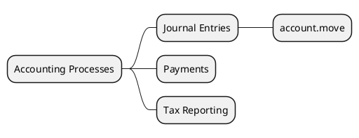

# Core Accounting Processes v18

## Key flows
- `[[Odoo 18/Core/Processes/Accounting/account_move.md]]`
- Journal control (placeholder)
- Tax reporting (placeholder)

## Next steps
- Detail payment matching (`account.payment`, bank reconciliation).
- Link inventory valuation moves coming from `stock.account` to `account.move`.
- Document closing process (lock dates, electronic invoicing).

## Navigation
- **Parent:** `[[Odoo 18/Core/Processes]]`
- **Siblings:** `[[Odoo 18/Core/Processes/Sales]]`, `[[Odoo 18/Core/Processes/Purchasing]]`, `[[Odoo 18/Core/Processes/Inventory]]`

## Children
- [[Odoo 18/Core/Processes/Accounting/account_move]]