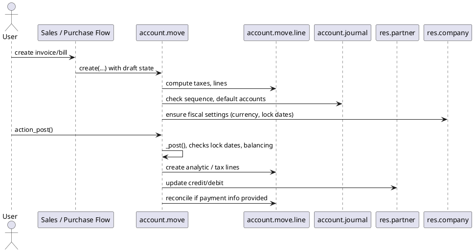

# Accounting Core Flow (Odoo 18)

> **Scope:** Captures the generic accounting lifecycle inside Community Edition. The “account” module establishes journals, moves, lines, reconciliation, and report scaffolding that every functional flow (sales, purchases, inventory, payroll) relies on.

## 1. Key models and responsibilities

| Model | Location | Purpose |
|-------|----------|---------|
| `account.move` | `odoo/addons/account/models/account_move.py` | Represents an accounting document (invoice, bill, journal entry). Handles posting, state transitions, message chatter, and attachments. |
| `account.move.line` | `odoo/addons/account/models/account_move_line.py` | The actual ledger entries (double-entry) linked to accounts, analytic tags, taxes. |
| `account.journal` | `odoo/addons/account/models/account_journal.py` | Configures journals (sale, purchase, bank, cash, general), sequences, default accounts. |
| `account.account` | `odoo/addons/account/models/account_account.py` | CoA accounts grouped in account groups; store type, tax deferrals, reconciliation flags. |
| `account.reconcile.model` | `odoo/addons/account/models/account_reconcile_model.py` | Templates and rules for automatic reconciliation. |
| `account.partial.reconcile` | `account_move_line.py` | Links move lines during matching (payments vs invoices). |
| `account.payment.register` (wizard) | `account_payment.py` | Handles quick payments from invoices/bills. |

All of these inherit from `mail.thread` and `mail.activity.mixin` for chatter and activities, tying into the messaging infrastructure documented in `[[Odoo 18/Core/Framework/Mail.md]]`.

## 2. Lifecycle of an invoice/bill

**Highlights from `_post()`** (`account_move.py`):
- Validates journal lock dates (`company_id.period_lock_date`, `fiscalyear_lock_date`).
- Ensures balanced debit/credit; raises `UserError` if not.
- Assigns name/sequence from the journal (leveraging `ir.sequence`).
- Creates analytic entries (`account.analytic.line`) if analytic accounts/tags present.
- Triggers auto-posting of tax cash basis moves when needed.
- Uses `self._check_balanced()` and `_post_validate_items()` to enforce business rules (e.g., blocked groups).

## 3. Reconciliation engine

### Types
- **Full reconciliation** (`account.full.reconcile`) – both sides matched, moves closed.
- **Partial reconciliation** (`account.partial.reconcile`) – residual amount remains.

### Helpers
- `account.reconcile.model`: builds matching rules (on amount, reference, partner).
- `account.move.line.reconcile()`: orchestrates matching, creates partial/full records, updates residuals.
- Payments generated through `account.payment.register` eventually call `action_post()` on the payment move and `action_assign_outstanding_credit()` to reconcile with invoices.

### Dependencies
- Bank statements modules (`account_bank_statement`) extend reconciliation by onboarding imported statements.
- SEPA/payment providers provide custom reconciliation models.

## 4. Reporting & closing

- **Reports** built via `account.report` (move to `account_reports` module in Enterprise). Core still provides aged partner balance, general ledger, tax reports.
- **Locking** handled in `res.company` fields: `period_lock_date`, `fiscalyear_lock_date`, `tax_lock_date`. Warnings raised in `_check_fiscalyear_lock_date`.
- **Year-end**: manual entries or modules like `account_reports` supply closing wizards (Community uses manual move + locking dates).

## 5. Cross-module interactions

| Flow | Integration |
|------|-------------|
| Sales (`sale_management`) | Confirmed orders create invoices via `sale.advance.payment.inv` and `account.move` auto-post (depending on company settings). Links to `res.partner` credit limit, follow-up levels. |
| Purchases (`purchase`) | Receipt + vendor bill may auto create `account.move`; integrates with landed costs and analytic distribution. |
| Inventory (`stock`) | Stock valuation journaling uses `account.move` with category-configured accounts (see `stock_account`). |
| Payroll (`hr_payroll`), Expenses, Subscriptions | Each creates `account.move` entries with appropriate journal types. |
| Taxes (`account_tax`) | Tax lines generated on moves feed tax reports; cash basis tax moves triggered on payments. |

## 6. Configuration references
- Chart of accounts loaded via `account.chart.template` (`data/account_financial_report_data.xml` etc.).
- Journals use `company_id` defaults, rely on `res.company` currency and fiscal localisation modules (see `[[Odoo 18/Core/Master Data/res_company.md]]`).
- Default accounts per company stored as `ir.property` entries (note pending: create a dedicated note covering property mechanics).

## 7. Navigation & related notes
- **Parent:** `[[Odoo 18/Core/Processes/Index]]`
- **Related:** `[[Odoo 18/Core/Master Data/res_company.md]]`, `[[Odoo 18/Core/Master Data/res_partner.md]]`, `[[Odoo 18/Core/Master Data/res_users.md]]`
- **Issue:** #8 `Docs: Odoo 18 Core Process - Accounting`

## 8. To-do
- [ ] Document tax engine specifics (cash basis moves, tax exigibility) with diagrams.
- [ ] Add an example entry (JSON payload from `/web/dataset/call_kw`) showing invoice creation.
- [ ] Link to reconciliation UI components and bank statement processing once documented.
