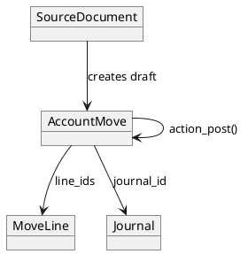

# `account.move` (Odoo 18)

> **Summary:** Journal entries consolidate financial impact from Sales, Purchases, Payroll, and inventory valuation. The model handles posting logic, reconciliations, taxes, and integration with reporting engines (aged balance, tax reports).

## Model snapshot
- **Python class:** `AccountMove` in `odoo/addons/account/models/account_move.py`
- **Table:** `account_move`
- **Key mixins:** `mail.thread`, `mail.activity.mixin` for audit trail; `attachment.mixin` for documents (see `[[Odoo 18/Core/Infrastructure/Files.md]]`).
- **Primary relations:**
  - `line_ids` (`account.move.line`) containing the double-entry splits.
  - `partner_id` linking to `[[Odoo 18/Core/Master Data/res_partner.md]]`.
  - `invoice_line_ids` (for move_type invoices) referencing `product_id` (`[[Odoo 18/Core/Master Data/product_product.md]]`).
  - `journal_id` controlling sequencing and default accounts.

## Posting pipeline
1. Source document (sale order, vendor bill, inventory valuation, manual entry) creates a draft move.
2. On posting (`action_post`):
   - Validates balancing (`amount_total`, debit = credit) and mandatory fields (journal, date, lines).
   - Assigns sequence (`name`) via `account.move.sequence.mixin`.
   - Locks modification if the period is closed (`fiscal_position`, `period_lock_date`).
3. Posted moves trigger downstream artefacts:
   - Payment status via `payment_state` and `invoice_payment_ref_ids`.
   - Tax base move lines for `account.tax.report`.
   - Attachments for signed invoices (`invoice_pdf_report_id`, `[[Odoo 18/Core/Infrastructure/Reports.md]]`).

## Controls & security
- Record rules restrict posting to allowed companies and journals (see `[[Odoo 18/Core/Infrastructure/Security.md]]`).
- Lock dates and hashes (`inalterability_hash`) enforce audit trail; rely on `account.journal` settings.
- Attachments (scanned invoices) stored through `message_main_attachment_id` follow the storage guidelines from `[[Odoo 18/Core/Infrastructure/Files.md]]`.

## Reporting links
- Trial balance, ledgers, and tax reports read from `account_move_line` aggregated by `account.account` and `tax_ids`.
- The invoice PDF uses QWeb templates defined in `account` module, reusing the web assets described in `[[Odoo 18/Core/Infrastructure/Reports.md]]`.
- Reconciliation widgets consume move lines via RPC routes (`/accounting/reconciliation`).

## Related notes
- Journals: `[[Odoo 18/Core/Processes/Accounting]]`
- Partners: `[[Odoo 18/Core/Master Data/res_partner.md]]`
- Products & taxes: `[[Odoo 18/Core/Master Data/product_template.md]]`, `[[Odoo 18/Core/Master Data/product_product.md]]`
- Odoo 19 comparison placeholder: `[[Comparisons]]`

## Navigation
- **Parent:** [[Odoo 18/Core/Processes/Accounting]]
