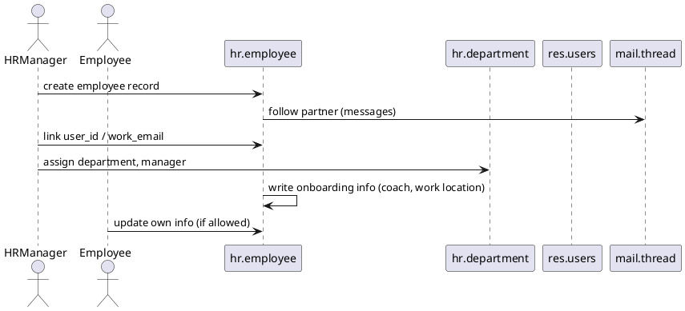

# HR Core Flow (Odoo 18)

> **Scope:** Describes the Human Resources backbone in Community Edition (module `hr`). Covers employee records, department hierarchy, attendance/leave integration, and the hooks used by payroll, recruitment, and timesheet modules.

## 1. Principal models

| Model | File | Responsibilities |
|-------|------|------------------|
| `hr.employee` | `addons/hr/models/hr_employee.py` | Stores employee details (personal info, work info, related user, company, department). Connects to work calendar, contact info, contracts (Enterprise). |
| `hr.department` | `addons/hr/models/hr_department.py` | Defines organizational tree, manager relationships. |
| `hr.job` | `addons/hr/models/hr_job.py` | Job positions, number of employees, recruitment pipeline integration. |
| `hr.employee.public` | `addons/hr/models/hr_employee.py` | Read-only view with limited fields for non-HR users. |

### Related optional modules
- `hr_attendance`, `hr_holidays`, `hr_timesheet`, `hr_payroll` (Enterprise) extend the flow with attendances, leaves, timesheets, payroll.

## 2. Employee lifecycle

### Fields of interest
- Identity: `name`, `work_email`, `work_phone`, `image_1920`, `gender`, `birthday` (requires HR group to see private info).
- Work info: `department_id`, `job_id`, `coach_id`, `parent_id` (manager), `resource_calendar_id`, `company_id`.
- User linking: `user_id` (res.users), `address_home_id` (private partner).
- Messaging: inherits from `mail.thread`, activities for appraisals and tasks.
- Activity-based: `leave_manager_id`, `timesheet_manager_id` for approvals in optional modules.

## 3. Privacy & access
- Private details stored on employee record; read access restricted to HR groups (`hr.group_hr_manager`, `hr.group_hr_user`). `hr.employee.public` exposes safe fields to everyone.
- Employees can be shared with portal/external users via `address_home_id`; ensures payroll/confidential data stays private.
- The related partner uses `is_company` false; home address used for documents (payslips, etc.).

## 4. Integrations
- **Attendance:** `hr_attendance` adds check-in/out records (`hr.attendance`) linked to employee and user.
- **Leaves:** `hr_holidays` uses `resource.calendar.leaves`, `hr.leave`; approval flows rely on `manager_id` and `leave_manager_id`.
- **Timesheets:** `hr_timesheet` (Enterprise) uses `account.analytic.line` entries with employee reference.
- **Payroll:** (Enterprise) connects to contracts (`hr.contract`), wage structures, payslips; uses employee data & calendars.
- **Recruitment:** `hr_recruitment` moves applicants to employee records.
- **Appraisals/Referrals:** add wizards extending mail activities.

## 5. Configuration pointers
- Settings via `res.config.settings` toggle features (departments, attendance, leaves, recruitment, payroll). Each module adds group toggles referencing `[[Odoo 18/Core/Master Data/res_users.md]]`.
- Company-specific settings: schedule, leave notifications, etc., stored via `res.company` fields.
- Security groups determine who can see private vs public data, links to `ir.model.access`/record rules.

## 6. Cross-links
- `[[Odoo 18/Core/Master Data/res_users.md]]` (user/employee linking).
- `[[Odoo 18/Core/Master Data/res_company.md]]` (company-level calendars, settings).
- `[[Odoo 18/Core/Processes/Projects/Index]]` (timesheets and employee assignments).
- Optional modules (`hr_attendance`, `hr_holidays`, `hr_timesheet`) to be documented under Community Services.

## 7. To-do (Issue #12)
- [ ] Detail `hr.employee.public` fields and security rules.
- [ ] Add example of employee creation wizard linking to user.
- [ ] Document interaction with `resource.calendar` (schedules) and `resource.resource`.

## Navigation
- **Parent:** `[[Odoo 18/Core/Processes/Index]]`
- **Related:** `[[Odoo 18/Core/Master Data/res_users.md]]`, `[[Odoo 18/Core/Master Data/res_company.md]]`, `[[Odoo 18/Community Addons/Services/Index]]`
- **Issue:** #12 `Docs: Odoo 18 Core Process - HR`
