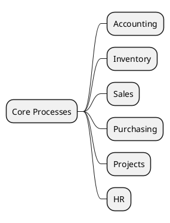

# Core Processes v18

## Core flows
- Accounting (`account`) -> `[[Odoo 18/Core/Processes/Accounting/Index]]`
- Inventory (`stock`) -> `[[Odoo 18/Core/Processes/Inventory/Index]]`
- Sales (`sale_management`) -> `[[Odoo 18/Core/Processes/Sales/Index]]`
- Purchasing (`purchase`) -> `[[Odoo 18/Core/Processes/Purchasing/Index]]`
- Projects (`project`) -> `[[Odoo 18/Core/Processes/Projects/Index]]`
- HR (`hr`) -> `[[Odoo 18/Core/Processes/HR/Index]]`

## Aim
- Document end-to-end flows with triggers, validations, and outputs.
- Integrate state and sequence diagrams.
- Highlight hooks for customizations.

## Navigation
- **Parent:** [[Odoo 18/Core/Index]]

## Children
- [[Odoo 18/Core/Processes/Accounting/Index]]
- [[Odoo 18/Core/Processes/HR/Index]]
- [[Odoo 18/Core/Processes/Inventory/Index]]
- [[Odoo 18/Core/Processes/Manufacturing/Index]]
- [[Odoo 18/Core/Processes/Projects/Index]]
- [[Odoo 18/Core/Processes/Purchasing/Index]]
- [[Odoo 18/Core/Processes/Sales/Index]]